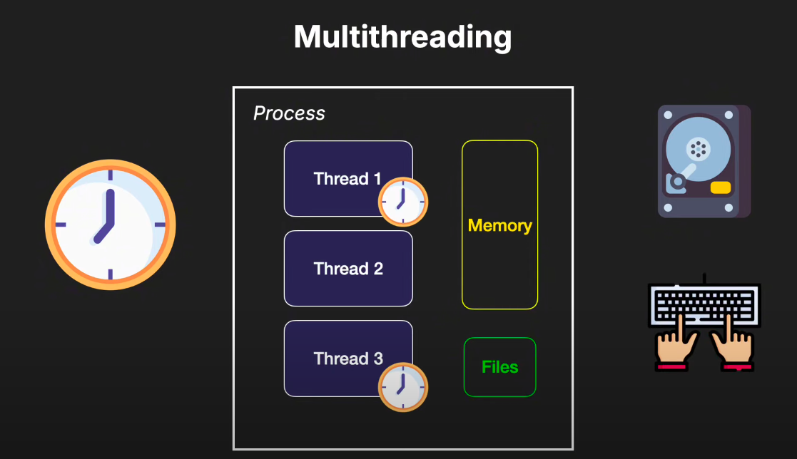
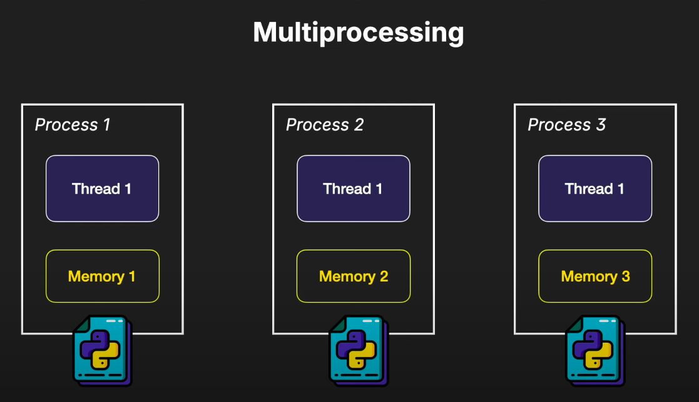

# Python Learning Journey
## What is Python?

Python is a high-level, interpreted programming language known for its readability and versatility. It supports multiple programming paradigms, including procedural, object-oriented, and functional programming. Python is widely used for web development, data analysis, artificial intelligence, scientific computing, and more.

## Is Python a Fully Object-Oriented Programming Language?

Python is not a fully object-oriented programming language, but it supports object-oriented programming (OOP) principles such as inheritance, polymorphism, encapsulation, and abstraction. It also supports procedural and functional programming paradigms.


## Why Python is Not a Fully Object-Oriented Programming Language

Python supports multiple programming paradigms, not just OOP. This flexibility allows developers to choose the most appropriate paradigm for their specific use case, but it also means that Python does not enforce OOP principles as strictly as some other languages.

### Fully Object-Oriented Programming Languages

Fully object-oriented languages enforce OOP principles throughout the language:
- **Smalltalk**: Treats everything as an object, including numbers and control structures.
- **Ruby**: Designed to be fully object-oriented, enforcing OOP principles strictly.

### Characteristics of Fully Object-Oriented Languages
1. **Everything is an Object**: All entities are objects.
2. **Message Passing**: Operations are performed by sending messages to objects.
3. **Encapsulation**: Data and methods are encapsulated within objects.
4. **Inheritance and Polymorphism**: Objects can inherit properties and methods, and polymorphism allows objects to be treated as instances of their parent class.

## Are Java, C++, and C# Fully Object-Oriented Programming Languages?

### Java
- **Mostly Object-Oriented**: Enforces OOP principles but has primitive data types (e.g., `int`, `char`, `boolean`) that are not objects. Provides wrapper classes (e.g., `Integer`, `Character`, `Boolean`).

### C++
- **Not Fully Object-Oriented**: Multi-paradigm language supporting procedural, object-oriented, and generic programming. Allows procedural programming with functions and global variables.

### C#
- **Mostly Object-Oriented**: Enforces OOP principles and treats everything as an object, including primitive data types through the .NET framework's `System` namespace. Provides struct types (e.g., `Int32`, `Char`, `Boolean`).

### Summary Table

| Language | Fully Object-Oriented | Notes |
|----------|-----------------------|-------|
| Python   | No                    | Supports multiple paradigms |
| Java     | Mostly                | Has primitive data types, uses wrapper classes |
| C++      | No                    | Multi-paradigm, supports procedural programming |
| C#       | Mostly                | Has primitive data types, uses struct types |

In summary, while Python supports OOP principles, its flexibility in supporting multiple paradigms means it is not considered fully object-oriented. Java and C# are close to being fully object-oriented but have some exceptions with primitive data types. C++ is not fully object-oriented due to its support for multiple programming paradigms.
### Built-in Data Types and Classes

In Python, everything is an object, including built-in data types:
- **Integers**: Instances of the `int` class.
- **Strings**: Instances of the `str` class.
- **Lists**: Instances of the `list` class.
- **Tuples**: Instances of the `tuple` class.
- **Dictionaries**: Instances of the `dict` class.
- **Floats**: Instances of the `float` class.
- **Complex Numbers**: Instances of the `complex` class.
- **Booleans**: Instances of the `bool` class.
- **Sets**: Instances of the `set` class.


### Example: Using Built-in Data Types as Classes
```python
# Integer
num = 10
print(type(num))  # Output: <class 'int'>

# String
message = "Hello, World!"
print(type(message))  # Output: <class 'str'>

# List
courses = ['Python', 'Java', 'C++']
print(type(courses))  # Output: <class 'list'>

# Tuple
coordinates = (10, 20)
print(type(coordinates))  # Output: <class 'tuple'>

# Dictionary
student = {'name': 'Hridoy', 'age': 23}
print(type(student))  # Output: <class 'dict'>

# Float
pi = 3.14159
print(type(pi))  # Output: <class 'float'>

# Complex Number
complex_num = 1 + 2j
print(type(complex_num))  # Output: <class 'complex'>

# Boolean
is_valid = True
print(type(is_valid))  # Output: <class 'bool'>

# Set
unique_numbers = {1, 2, 3}
print(type(unique_numbers))  # Output: <class 'set'>
```

## Python String Operations

### Basic String Operations
```python
message = "Hello World"
escape = 'Hridoy\'s World'
using_single_to_handle_double = 'I am going to be a "..."'
using_double_to_handle_single = "I am going to be a '...'"
muliple_line = """
This is great to learn python 
from "Corey Shefer's" lessons and just awesome
"""
print(message)
print(escape)
print(using_single_to_handle_double)
print(using_double_to_handle_single)
print(muliple_line)
```

### String Length and Indexing
```python
print(len(message))  # Output: 11
print(message[0])    # Output: H
print(message[-1])   # Output: d
print(message[10])   # Output: d
# print(message[11]) # IndexError: string index out of range
```

### String Slicing
```python
print(message[0:5])  # Output: Hello (start is inclusive, end is exclusive)
print(message[:5])   # Output: Hello
print(message[6:])   # Output: World
```

### String Methods
```python
print(message.lower())  # Output: hello world
print(message)          # Output: Hello World
print(message.upper())  # Output: HELLO WORLD
print(message.count('l'))  # Output: 3
print(message.find('l'))   # Output: 2
print(message.count("ll")) # Output: 1
print(message.find('Universe'))  # Output: -1 (not found)
```

### String Replacement
```python
print(message.replace('World', 'Bangladesh'))  # Output: Hello Bangladesh
print(message)  # Output: Hello World
message = message.replace('World', 'Bangladesh')
print(message)  # Output: Hello Bangladesh
```

### String Concatenation
```python
greeting = 'Bye bye'
name = 'Muhammad Ali'
message = greeting + ', ' + name + '. See you!'
print(message)  # Output: Bye bye, Muhammad Ali. See you!
```

### String Formatting
```python
message = '{}, {}. See you!'.format(greeting, name.upper())
print(message)  # Output: Bye bye, MUHAMMAD ALI. See you!

message = f'{greeting}, {name.upper()}. See you!'
print(message)  # Output: Bye bye, MUHAMMAD ALI. See you!
```

### String Methods and Help
```python
print(dir(message))  # Lists all the attributes and methods of the string object
print(help(str))     # Provides help documentation for the str class
print(help(str.lower))  # Provides help documentation for the lower() method
```

## Basic Python Operations

### 1. Variable Assignment and Type Checking
Assigning integer and float values to variables, and printing the values and their types.
```python
num = 3
print(num)  # Output: 3
print(type(num))  # Output: <class 'int'>

float_num = 3.1416
print(float_num)  # Output: 3.1416
print(type(float_num))  # Output: <class 'float'>
```

### 2. Arithmetic Operations
Performing addition, subtraction, multiplication, division, floor division, exponentiation, and modulus operations. Demonstrating operator precedence with parentheses.
```python
# Arithmetic Operators
print(3 + 2)  # Output: 5
print(3 - 2)  # Output: 1
print(3 * 2)  # Output: 6
print(3 / 2)  # Output: 1.5
print(3 // 2)  # Output: 1
print(3 ** 2)  # Output: 9

# Modulus operation to observe the pattern of even and odd numbers
print(3 % 2)  # Output: 1
print(4 % 2)  # Output: 0
print(5 % 2)  # Output: 1
print(6 % 2)  # Output: 0

# Operator precedence
print(3 * 2 + 1)  # Output: 7
print(3 * (2 + 1))  # Output: 9
```

### 3. Variable Manipulation
Incrementing and multiplying variables using shorthand operators. Using the `abs()` function to get the absolute value of a number. Using the `round()` function to round a floating-point number to a specified number of decimal places.
```python
num = 1
print(num)  # Output: 1
num = num + 1
print(num)  # Output: 2
num += 1
print(num)  # Output: 3

num *= 10
print(num)  # Output: 30

num = -3
print(num)  # Output: -3
print(abs(num))  # Output: 3

print(float_num)  # Output: 3.1416
print(round(float_num))  # Output: 3
print(round(float_num, 2))  # Output: 3.14
```

### 4. Comparison Operators
Checking equality, inequality, and relational comparisons between two numbers. Demonstrating string concatenation and type conversion from string to integer for arithmetic operations.
```python
num_1 = 3
num_2 = 2

print(num_1 == num_2)  # Output: False
print(num_1 < num_2)  # Output: False
print(num_1 <= num_2)  # Output: False
print(num_1 != num_2)  # Output: True
print(num_1 > num_2)  # Output: True
print(num_1 >= num_2)  # Output: True

num_1 = '100'
num_2 = '200'
print(num_1 + num_2)  # Output: 100200
num_1 = int(num_1)
num_2 = int(num_2)
print(num_1 + num_2)  # Output: 300
```

## List, Tuple, and Set Operations

### List Operations
Lists in Python are mutable, meaning they can be changed after creation. Here are some common operations you can perform on lists:

#### Creating and Accessing Lists
```python
courses = ['Algorithm', 'Python', 'Java', 'DS', 'C++']
print(courses)  # Output: ['Algorithm', 'Python', 'Java', 'DS', 'C++']
print(len(courses))  # Output: 5
print(courses[0])  # Output: Algorithm
print(courses[4])  # Output: C++
print(courses[-1])  # Output: C++
print(courses[-4])  # Output: Python
```

#### Slicing Lists
```python
print(courses[1:5])  # Output: ['Python', 'Java', 'DS', 'C++']
print(courses[:5])  # Output: ['Algorithm', 'Python', 'Java', 'DS', 'C++']
print(courses[1:])  # Output: ['Python', 'Java', 'DS', 'C++']
```

#### Modifying Lists
```python
courses.append('Django')
print(courses)  # Output: ['Algorithm', 'Python', 'Java', 'DS', 'C++', 'Django']

courses.insert(0, 'Fundamentals')
print(courses)  # Output: ['Fundamentals', 'Algorithm', 'Python', 'Java', 'DS', 'C++', 'Django']

courses_2 = ['Dart', 'Flutter']
courses.insert(0, courses_2)
print(courses)  # Output: [['Dart', 'Flutter'], 'Fundamentals', 'Algorithm', 'Python', 'Java', 'DS', 'C++', 'Django']
print(courses[0])  # Output: ['Dart', 'Flutter']

courses.pop(0)
print(courses)  # Output: ['Fundamentals', 'Algorithm', 'Python', 'Java', 'DS', 'C++', 'Django']

courses.append(courses_2)
print(courses)  # Output: ['Fundamentals', 'Algorithm', 'Python', 'Java', 'DS', 'C++', 'Django', ['Dart', 'Flutter']]

courses.pop()
print(courses)  # Output: ['Fundamentals', 'Algorithm', 'Python', 'Java', 'DS', 'C++', 'Django']

courses.extend(courses_2)
print(courses)  # Output: ['Fundamentals', 'Algorithm', 'Python', 'Java', 'DS', 'C++', 'Django', 'Dart', 'Flutter']

courses.remove('Fundamentals')
print(courses)  # Output: ['Algorithm', 'Python', 'Java', 'DS', 'C++', 'Django', 'Dart', 'Flutter']

popped = courses.pop()
print(popped)  # Output: Flutter
print(courses)  # Output: ['Algorithm', 'Python', 'Java', 'DS', 'C++', 'Django', 'Dart']
```

#### Reversing and Sorting Lists
```python
courses.reverse()
print(courses)  # Output: ['Dart', 'Django', 'C++', 'DS', 'Java', 'Python', 'Algorithm']

courses.sort()
print(courses)  # Output: ['Algorithm', 'C++', 'DS', 'Dart', 'Django', 'Java', 'Python']

nums = [1, 3, 4, 2, 1, 88, 12, 9]
nums.sort()
print(nums)  # Output: [1, 1, 2, 3, 4, 9, 12, 88]

nums.sort(reverse=True)
print(nums)  # Output: [88, 12, 9, 4, 3, 2, 1, 1]

sorted_nums_ascen = sorted(nums)
print(sorted_nums_ascen)  # Output: [1, 1, 2, 3, 4, 9, 12, 88]
print(nums)  # Output: [88, 12, 9, 4, 3, 2, 1, 1]
```

#### Other List Operations
```python
print(min(nums))  # Output: 1
print(max(nums))  # Output: 88
print(sum(nums))  # Output: 120

print(courses.index('Java'))  # Output: 5
print('Art' in courses)  # Output: False
print('C++' in courses)  # Output: True

for course in courses:
    print(course)

for index, course in enumerate(courses, start=1):
    print(index, course)

courses_str = ', '.join(courses)
print(courses_str)  # Output: Algorithm, C++, DS, Dart, Django, Java, Python

courses_str = ' $ '.join(courses)
print(courses_str)  # Output: Algorithm $ C++ $ DS $ Dart $ Django $ Java $ Python

new_list_of_courses = courses_str.split(' $ ')
print(new_list_of_courses)  # Output: ['Algorithm', 'C++', 'DS', 'Dart', 'Django', 'Java', 'Python']
```

#### List Mutability
```python
list_1 = ['Tanha', 'Tasin', 'Nova', 'Rupa', 'Hridoy']
list_2 = list_1
print(list_1)  # Output: ['Tanha', 'Tasin', 'Nova', 'Rupa', 'Hridoy']
print(list_2)  # Output: ['Tanha', 'Tasin', 'Nova', 'Rupa', 'Hridoy']

list_1[0] = 'Unknown!'
print(list_1)  # Output: ['Unknown!', 'Tasin', 'Nova', 'Rupa', 'Hridoy']
print(list_2)  # Output: ['Unknown!', 'Tasin', 'Nova', 'Rupa', 'Hridoy']
```

### Tuple Operations
Tuples in Python are immutable, meaning they cannot be changed after creation. They are useful for fixed collections of items.

```python
tuple_1 = ('Tanha', 'Tasin', 'Nova', 'Rupa', 'Hridoy')
tuple_2 = tuple_1

print(tuple_1)  # Output: ('Tanha', 'Tasin', 'Nova', 'Rupa', 'Hridoy')
print(tuple_2)  # Output: ('Tanha', 'Tasin', 'Nova', 'Rupa', 'Hridoy')

# tuple_1[0] = 'Unknown!'  # This will raise a TypeError
```

### Set Operations
Sets in Python are unordered collections of unique elements. They are useful for membership tests and eliminating duplicate entries.

```python
cs_courses = {'Discrete Mathematics', 'Fundamentals of Computer', 'Software Engineering', 'Computer Networks'}
print(cs_courses)  # Output: {'Discrete Mathematics', 'Fundamentals of Computer', 'Software Engineering', 'Computer Networks'}
```


## List, Tuple, and Set Operations

### List Operations
Lists in Python are mutable, meaning they can be changed after creation. Here are some common operations you can perform on lists:

#### Creating and Accessing Lists
```python
courses = ['Algorithm', 'Python', 'Java', 'DS', 'C++']
print(courses)  # Output: ['Algorithm', 'Python', 'Java', 'DS', 'C++']
print(len(courses))  # Output: 5
print(courses[0])  # Output: Algorithm
print(courses[4])  # Output: C++
print(courses[-1])  # Output: C++
print(courses[-4])  # Output: Python
```

#### Slicing Lists
```python
print(courses[1:5])  # Output: ['Python', 'Java', 'DS', 'C++']
print(courses[:5])  # Output: ['Algorithm', 'Python', 'Java', 'DS', 'C++']
print(courses[1:])  # Output: ['Python', 'Java', 'DS', 'C++']
```

#### Modifying Lists
```python
courses.append('Django')
print(courses)  # Output: ['Algorithm', 'Python', 'Java', 'DS', 'C++', 'Django']

courses.insert(0, 'Fundamentals')
print(courses)  # Output: ['Fundamentals', 'Algorithm', 'Python', 'Java', 'DS', 'C++', 'Django']

courses_2 = ['Dart', 'Flutter']
courses.insert(0, courses_2)
print(courses)  # Output: [['Dart', 'Flutter'], 'Fundamentals', 'Algorithm', 'Python', 'Java', 'DS', 'C++', 'Django']
print(courses[0])  # Output: ['Dart', 'Flutter']

courses.pop(0)
print(courses)  # Output: ['Fundamentals', 'Algorithm', 'Python', 'Java', 'DS', 'C++', 'Django']

courses.append(courses_2)
print(courses)  # Output: ['Fundamentals', 'Algorithm', 'Python', 'Java', 'DS', 'C++', 'Django', ['Dart', 'Flutter']]

courses.pop()
print(courses)  # Output: ['Fundamentals', 'Algorithm', 'Python', 'Java', 'DS', 'C++', 'Django']

courses.extend(courses_2)
print(courses)  # Output: ['Fundamentals', 'Algorithm', 'Python', 'Java', 'DS', 'C++', 'Django', 'Dart', 'Flutter']

courses.remove('Fundamentals')
print(courses)  # Output: ['Algorithm', 'Python', 'Java', 'DS', 'C++', 'Django', 'Dart', 'Flutter']

popped = courses.pop()
print(popped)  # Output: Flutter
print(courses)  # Output: ['Algorithm', 'Python', 'Java', 'DS', 'C++', 'Django', 'Dart']
```

#### Reversing and Sorting Lists
```python
courses.reverse()
print(courses)  # Output: ['Dart', 'Django', 'C++', 'DS', 'Java', 'Python', 'Algorithm']

courses.sort()
print(courses)  # Output: ['Algorithm', 'C++', 'DS', 'Dart', 'Django', 'Java', 'Python']

nums = [1, 3, 4, 2, 1, 88, 12, 9]
nums.sort()
print(nums)  # Output: [1, 1, 2, 3, 4, 9, 12, 88]

nums.sort(reverse=True)
print(nums)  # Output: [88, 12, 9, 4, 3, 2, 1, 1]

sorted_nums_ascen = sorted(nums)
print(sorted_nums_ascen)  # Output: [1, 1, 2, 3, 4, 9, 12, 88]
print(nums)  # Output: [88, 12, 9, 4, 3, 2, 1, 1]
```

#### Other List Operations
```python
print(min(nums))  # Output: 1
print(max(nums))  # Output: 88
print(sum(nums))  # Output: 120

print(courses.index('Java'))  # Output: 5
print('Art' in courses)  # Output: False
print('C++' in courses)  # Output: True

for course in courses:
    print(course)

for index, course in enumerate(courses, start=1):
    print(index, course)

courses_str = ', '.join(courses)
print(courses_str)  # Output: Algorithm, C++, DS, Dart, Django, Java, Python

courses_str = ' $ '.join(courses)
print(courses_str)  # Output: Algorithm $ C++ $ DS $ Dart $ Django $ Java $ Python

new_list_of_courses = courses_str.split(' $ ')
print(new_list_of_courses)  # Output: ['Algorithm', 'C++', 'DS', 'Dart', 'Django', 'Java', 'Python']
```

#### List Mutability
```python
list_1 = ['Tanha', 'Tasin', 'Nova', 'Rupa', 'Hridoy']
list_2 = list_1
print(list_1)  # Output: ['Tanha', 'Tasin', 'Nova', 'Rupa', 'Hridoy']
print(list_2)  # Output: ['Tanha', 'Tasin', 'Nova', 'Rupa', 'Hridoy']

list_1[0] = 'Unknown!'
print(list_1)  # Output: ['Unknown!', 'Tasin', 'Nova', 'Rupa', 'Hridoy']
print(list_2)  # Output: ['Unknown!', 'Tasin', 'Nova', 'Rupa', 'Hridoy']
```

### Tuple Operations
Tuples in Python are immutable, meaning they cannot be changed after creation. They are useful for fixed collections of items.

```python
tuple_1 = ('Tanha', 'Tasin', 'Nova', 'Rupa', 'Hridoy')
tuple_2 = tuple_1

print(tuple_1)  # Output: ('Tanha', 'Tasin', 'Nova', 'Rupa', 'Hridoy')
print(tuple_2)  # Output: ('Tanha', 'Tasin', 'Nova', 'Rupa', 'Hridoy')

# tuple_1[0] = 'Unknown!'  # This will raise a TypeError
```

### Set Operations
Sets in Python are unordered collections of unique elements. They are useful for membership tests and eliminating duplicate entries.

```python
cs_courses = {'Discrete Mathematics', 'Fundamentals of Computer', 'Software Engineering', 'Computer Networks'}
print(cs_courses)  # Output: {'Discrete Mathematics', 'Fundamentals of Computer', 'Software Engineering', 'Computer Networks'}

# Membership test
print('Computer Networks' in cs_courses)  # Output: True

ece_courses = {'Digital Communication', 'Fundamentals of Computer', 'Software Engineering', 'Computer Networks', 'Digital Electronics'}
print(ece_courses)  # Output: {'Digital Communication', 'Fundamentals of Computer', 'Software Engineering', 'Computer Networks', 'Digital Electronics'}

print(cs_courses.intersection(ece_courses))  # Output: {'Fundamentals of Computer', 'Software Engineering', 'Computer Networks'}
print(cs_courses.difference(ece_courses))  # Output: {'Discrete Mathematics'}
print(cs_courses.union(ece_courses))  # Output: {'Discrete Mathematics', 'Fundamentals of Computer', 'Software Engineering', 'Computer Networks', 'Digital Communication', 'Digital Electronics'}
```

### Creating Empty Collections
```python
# Empty lists
empty_list = []
empty_list = list()

# Empty tuples
empty_tuple = ()
empty_tuple = tuple()

# Empty sets
empty_set = set()
```
### Summary

| Feature             | Lists                                      | Tuples                                     | Sets                                      |
|---------------------|--------------------------------------------|--------------------------------------------|-------------------------------------------|
| Mutability          | Mutable (can be changed)                   | Immutable (cannot be changed)              | Mutable (can be changed)                  |
| Order               | Ordered                                    | Ordered                                    | Unordered                                 |
| Duplicates          | Allows duplicate elements                  | Allows duplicate elements                  | Does not allow duplicate elements         |
| Common Operations   | Creating, accessing, slicing, modifying, reversing, sorting, and other list-specific methods | Creating and accessing                     | Membership tests, eliminating duplicates, union, intersection, difference |
| Use Case            | General-purpose, flexible collections      | Fixed collections of items                 | Unique collections, set operations        |
| Empty Collections   | `empty_list = []` or `empty_list = list()` | `empty_tuple = ()` or `empty_tuple = tuple()` | `empty_set = set()` (not `{}` which creates a dictionary) |


## Dictionary Operations

Dictionaries in Python are mutable, unordered collections of key-value pairs. Keys can be any immutable data types, such as strings, numbers, or tuples.

### Creating and Accessing Dictionaries
```python
student = {'name': 'Hridoy', 'age': 23, 'courses': ['Python', 'Java'], 1: 'Islam'}
print(student)  # Output: {'name': 'Hridoy', 'age': 23, 'courses': ['Python', 'Java'], 1: 'Islam'}
print(student['name'])  # Output: Hridoy
print(student['courses'])  # Output: ['Python', 'Java']
print(student[1])  # Output: Islam
print(student.get('name'))  # Output: Hridoy
# print(student['phone'])  # KeyError: 'phone'
print(student.get('phone'))  # Output: None
print(student.get('phone', 'Not Found!'))  # Output: Not Found!
```

### Adding and Updating Dictionary Entries
```python
student['phone'] = '017XXXXXXXX'
print(student.get('phone', 'Not Found!'))  # Output: 017XXXXXXXX
student['name'] = 'SRHridoy'
print(student)  # Output: {'name': 'SRHridoy', 'age': 23, 'courses': ['Python', 'Java'], 1: 'Islam', 'phone': '017XXXXXXXX'}

# Multiple updates
student.update({'name': 'Md. Sohanur Rahman Hridoy', 'isMarried': True})
print(student)  # Output: {'name': 'Md. Sohanur Rahman Hridoy', 'age': 23, 'courses': ['Python', 'Java'], 1: 'Islam', 'phone': '017XXXXXXXX', 'isMarried': True}
```

### Removing Dictionary Entries
```python
del student[1]
print(student)  # Output: {'name': 'Md. Sohanur Rahman Hridoy', 'age': 23, 'courses': ['Python', 'Java'], 'phone': '017XXXXXXXX', 'isMarried': True}

popped = student.pop('isMarried')
print(popped)  # Output: True
print(student)  # Output: {'name': 'Md. Sohanur Rahman Hridoy', 'age': 23, 'courses': ['Python', 'Java'], 'phone': '017XXXXXXXX'}
```

### Dictionary Methods
```python
print(len(student))  # Output: 4
print(student.keys())  # Output: dict_keys(['name', 'age', 'courses', 'phone'])
print(student.values())  # Output: dict_values(['Md. Sohanur Rahman Hridoy', 23, ['Python', 'Java'], '017XXXXXXXX'])
print(student.items())  # Output: dict_items([('name', 'Md. Sohanur Rahman Hridoy'), ('age', 23), ('courses', ['Python', 'Java']), ('phone', '017XXXXXXXX')])
```

### Iterating Through a Dictionary
```python
for key, value in student.items():
    print(key, value)
    # Output:
    # name Md. Sohanur Rahman Hridoy
    # age 23
    # courses ['Python', 'Java']
    # phone 017XXXXXXXX

for key, value in student.items():
    print(f'{key} : {value}')
    # Output:
    # name : Md. Sohanur Rahman Hridoy
    # age : 23
    # courses : ['Python', 'Java']
    # phone : 017XXXXXXXX
```


## Conditional Statements and Match Statements

### Traditional Conditional Statements
Python supports traditional conditional statements using `if`, `elif`, and `else` keywords. Here are some examples:

#### Example 1: Language Check
```python
language = 'Python'

if language == 'Python':
    print('Language is Python')
elif language == 'Java':
    print('Language is Java')
elif language == 'JavaScript':
    print('Language is JavaScript')
else:
    print('No Match')
```

#### Example 2: User Authentication
```python
user = 'Admin'
logged_in = True

if user == 'Admin' and logged_in:
    print('Admin Page')
else:
    print('Bad Credentials')

if not logged_in:
    print('Please log in')
else:
    print('Welcome')
```

### Match Statements
Python 3.10 introduced the `match` statement, which is similar to switch-case statements in other languages. It allows for more readable and concise code when dealing with multiple conditions.

#### Example 1: Language Check with Match
```python
language = 'Python'

match language:
    case 'Python':
        print('Language is Python')
    case 'Java':
        print('Language is Java')
    case 'JavaScript':
        print('Language is JavaScript')
    case _:
        print('No Match')
```

### Identity and Equality
Python provides two ways to compare objects: `==` for equality and `is` for identity.

#### Example: Comparing Lists
```python
a = [1, 2, 3]
b = [1, 2, 3]

print(a == b)  # Output: True (values are equal)
print(a is b)  # Output: False (different objects)
print(id(a))   # Output: Unique id of a
print(id(b))   # Output: Unique id of b
print(id(a) == id(b))  # Output: False (different ids)

a = b
print(a == b)  # Output: True (values are equal)
print(a is b)  # Output: True (same object)
print(id(a))   # Output: Unique id of a
print(id(b))   # Output: Unique id of b
print(id(a) == id(b))  # Output: True (same ids)
```

### False Values in Python
Python considers several values as `False` in a boolean context. These include `False`, `None`, `0`, `0.0`, `''`, `()`, `[]`, and `{}`.

#### Example: Checking False Values
```python
false_values = [False, None, 0, 0.0, '', (), [], {}]

for value in false_values:
    if value:
        print(f'{value} is True')
    else:
        print(f'{value} is False')
```

### Checking for Empty Collections
You can check if a list, dictionary, or tuple is empty using the `not` keyword.

#### Example: Empty Collections
```python
sample_list = []
sample_dict = {}
sample_tuple = ()

if not sample_list:
    print('The list is empty')
else:
    print('The list is not empty')

if not sample_dict:
    print('The dictionary is empty')
else:
    print('The dictionary is not empty')

if not sample_tuple:
    print('The tuple is empty')
else:
    print('The tuple is not empty')
```


# Loop through each number in the list `nums`
```python
nums = [1, 2, 3, 4, 5]

for num in nums:
    if num == 3:
        print('Found!')
        break
    print(num)
```

# Loop through each number in the list `nums` again
```python
for num in nums:
    if num == 3:
        print('Skipped!')
        continue
    print(num)
```

# Nested loop: Loop through each number in the list `nums`
```python
for num in nums:
    for letter in 'Umar':
        print(num, letter)
```

# Loop from 0 to n-1
```python
n = 10

for i in range(n):
    print(i * 5)
```

# Loop from 1 to n (inclusive)
```python
for i in range(1, n + 1):
    print(f'{5} X {i} = {5 * i}')
```

# Prompt the user to enter the number of rows and a symbol
```python
userInput = int(input('Enter the number of rows: '))
userInput2 = input('Enter a symbol: ')

for i in range(1, userInput + 1):
    for j in range(i):
        print(userInput2, end='')
    print()
```

# Loop from 0 to n-1
```python
for i in range(n):
    print(userInput2 * i)
```

# Loop while x is less than 10
```python
x = 0

while x < 10:
    print(x)
    x += 1
```


## Function Definitions and Usage

### 1. `hello_func()`
```python
def hello_func():
    """
    A placeholder function that does nothing.
    """
    pass
```
- **Description**: This function is a placeholder and does not perform any operations.

### 2. `greetings()`
```python
def greetings():
    """
    Prints a greeting message 'Good Morning!'.
    """
    print('Good Morning!')
```
- **Description**: This function prints a greeting message "Good Morning!".

### 3. `hi()`
```python
def hi():
    """
    Returns a greeting message 'Hi, Hridoy!'.
    
    Returns:
        str: A greeting message.
    """
    return 'Hi, Hridoy!'
```
- **Description**: This function returns a greeting message "Hi, Hridoy!".
- **Returns**: A string containing the greeting message.

### 4. `cus_greet(name)`
```python
def cus_greet(name):
    """
    Returns a customized greeting message.
    
    Args:
        name (str): The name to include in the greeting.
    
    Returns:
        str: A customized greeting message.
    """
    return f'Good Morning, {name}!'
```
- **Description**: This function returns a customized greeting message.
- **Arguments**:
  - `name` (str): The name to include in the greeting.
- **Returns**: A string containing the customized greeting message.

### 5. `student_info(name, std_id='2102002')`
```python
def student_info(name, std_id='2102002'):
    """
    Returns student information in a formatted string.
    
    Args:
        name (str): The name of the student.
        std_id (str, optional): The student ID. Defaults to '2102002'.
    
    Returns:
        str: Formatted student information.
    """
    return f'{name} , {std_id}'
```
- **Description**: This function returns student information in a formatted string.
- **Arguments**:
  - `name` (str): The name of the student.
  - `std_id` (str, optional): The student ID. Defaults to '2102002'.
- **Returns**: A string containing the formatted student information.

### 6. `bus_info(*args, **kwargs)`
```python
def bus_info(*args, **kwargs):
    """
    Prints positional and keyword arguments.
    
    Args:
        *args: Variable length argument list.
        **kwargs: Arbitrary keyword arguments.
    """
    print(args)
    print(kwargs)
```
- **Description**: This function prints the positional and keyword arguments passed to it.
- **Arguments**:
  - `*args`: Variable length argument list.
  - `**kwargs`: Arbitrary keyword arguments.

### 7. `course_info(*args, **kwargs)`
```python
def course_info(*args, **kwargs):
    """
    Prints course information from positional and keyword arguments.
    
    Args:
        *args: Variable length argument list.
        **kwargs: Arbitrary keyword arguments.
    """
    print(args)
    print(kwargs)
```
- **Description**: This function prints course information from the positional and keyword arguments passed to it.
- **Arguments**:
  - `*args`: Variable length argument list.
  - `**kwargs`: Arbitrary keyword arguments.

# Function Arguments and Return Statement

## Types of Function Arguments in Python
There are four types of arguments that we can provide in a function:

1. Default Arguments
2. Keyword Arguments
3. Variable-length Arguments
4. Required Arguments

---

## 1. Default Arguments
We can provide a default value while creating a function. This way, the function assumes a default value even if a value is not provided in the function call for that argument.

### Example:
```python
def name(fname, mname="Jhon", lname="Whatson"):
    print("Hello,", fname, mname, lname)
name("Amy")
```
### Output:
```
Hello, Amy Jhon Whatson
```

---

## 2. Keyword Arguments
We can provide arguments with `key = value`, allowing the interpreter to recognize the arguments by the parameter name. The order in which the arguments are passed does not matter.

### Example:
```python
def name(fname, mname, lname):
    print("Hello,", fname, mname, lname)
name(mname="Peter", lname="Wesker", fname="Jade")
```
### Output:
```
Hello, Jade Peter Wesker
```

---

## 3. Required Arguments
If we don’t pass the arguments with a `key = value` syntax, then it is necessary to pass the arguments in the correct positional order, and the number of arguments passed should match the actual function definition.

### Example 1: When the number of arguments passed does not match the actual function definition.
```python
def name(fname, mname, lname):
    print("Hello,", fname, mname, lname)
name("Peter", "Quill")
```
### Output:
```
TypeError: name() missing 1 required positional argument: 'lname'
```

### Example 2: When the number of arguments passed matches the actual function definition.
```python
def name(fname, mname, lname):
    print("Hello,", fname, mname, lname)
name("Peter", "Ego", "Quill")
```
### Output:
```
Hello, Peter Ego Quill
```

---

## 4. Variable-length Arguments
Sometimes, we may need to pass more arguments than those defined in the actual function. This can be done using variable-length arguments.

### Two ways to achieve this:

### a) Arbitrary Arguments (`*args`)
While creating a function, pass a `*` before the parameter name. The function accesses the arguments by processing them as a tuple.

#### Example:
```python
def name(*name):
    print("Hello,", name[0], name[1], name[2])
name("James", "Buchanan", "Barnes")
```
#### Output:
```
Hello, James Buchanan Barnes
```

### b) Keyword Arbitrary Arguments (`**kwargs`)
While creating a function, pass `**` before the parameter name. The function accesses the arguments by processing them as a dictionary.

#### Example:
```python
def name(**name):
    print("Hello,", name["fname"], name["mname"], name["lname"])
name(mname="Buchanan", lname="Barnes", fname="James")
```
#### Output:
```
Hello, James Buchanan Barnes
```

### Example:
```python
def summation(*numbers):
    sum = 0
    for num in numbers:
        sum += num
        
    return sum

print(summation(1,2,3,4,5,6,7,8,9))
print(summation(1,2,3,4,5))

def personal_info(**infos):
    return f"{infos['fname']} {infos['lname']} is a {infos['occupation']}"

print(personal_info(fname = 'Sohanur',occupation = 'Software Engineer',lname = 'Rahman'))

#output:
# 45
# 15
# Sohanur Rahman is an Software Engineer
```

---

## Return Statement
The `return` statement is used to return the value of an expression back to the calling function.

### Example:
```python
def name(fname, mname, lname):
    return "Hello, " + fname + " " + mname + " " + lname
print(name("James", "Buchanan", "Barnes"))
```
### Output:
```
Hello, James Buchanan Barnes
```
## Magic/Dunder Methods in Python

These are special methods that you can define in your classes, and when invoked, they give you a powerful way to manipulate objects and their behaviour.

Magic methods, also known as “dunders” from the double underscores surrounding their names, are powerful tools that allow you to customize the behaviour of your classes. They are used to implement special methods such as the addition, subtraction and comparison operators, as well as some more advanced techniques like descriptors and properties.

### Commonly Used Magic Methods in Python

#### `__init__` method
The `__init__` method is a special method that is automatically invoked when you create a new instance of a class. This method is responsible for setting up the object’s initial state, and it is where you would typically define any instance variables that you need. Also called the "constructor".

#### `__str__` and `__repr__` methods
The `__str__` and `__repr__` methods are both used to convert an object to a string representation. The `__str__` method is used when you want to print out an object, while the `__repr__` method is used when you want to get a string representation of an object that can be used to recreate the object.

#### `__len__` method
The `__len__` method is used to get the length of an object. This is useful when you want to be able to find the size of a data structure, such as a list or dictionary.

#### `__call__` method
The `__call__` method is used to make an object callable, meaning that you can pass it as a parameter to a function and it will be executed when the function is called. This is an incredibly powerful tool that allows you to create objects that behave like functions.

These are just a few of the many magic methods available in Python. They are incredibly powerful tools that allow you to customize the behaviour of your objects, and can make your code much cleaner and easier to understand. So if you’re looking for a way to take your Python code to the next level, take some time to learn about these magic methods.

### Example: Employee Class with Magic Methods

Below is an example of an `Employee` class that demonstrates the use of several magic methods:

```python
class Employee:
    def __init__(self, name):
        self.name = name
        
    def __len__(self):
        i = 0
        for c in self.name:
            i += 1
        return i
    
    def __str__(self):
        return f'The name of the employee is {self.name} str.'
    
    def __call__(self, *args, **kwds):
        print(f'Employee name is {self.name}')
    
    def __repr__(self):
        return f"Employee('{self.name}')"
        
e = Employee("Hridoy")
print(e)          # Output: The name of the employee is Hridoy str.
print(str(e))     # Output: The name of the employee is Hridoy str.
print(repr(e))    # Output: Employee('Hridoy')
e()               # Output: Employee name is Hridoy
```

### Explanation

- `__init__(self, name)`: Initializes the `Employee` object with a `name` attribute.
- `__len__(self)`: Returns the length of the employee's name.
- `__str__(self)`: Returns a human-readable string representation of the `Employee` object.
- `__call__(self, *args, **kwds)`: Makes the `Employee` instance callable, printing the employee's name.
- `__repr__(self)`: Returns an unambiguous string representation of the `Employee` object.

Magic methods enhance the functionality and usability of your custom classes, making them more intuitive and easier to work with.


## Lambda Functions in Python

In Python, a lambda function is a small anonymous function without a name. It is defined using the `lambda` keyword and has the following syntax:

```python
lambda arguments: expression
```

Lambda functions are often used in situations where a small function is required for a short period of time. They are commonly used as arguments to higher-order functions, such as `map`, `filter`, and `reduce`.

Here is an example of how to use a lambda function:

### Function to Double the Input

```python
# Regular function to double the input
def double(x):
    return x * 2

# Lambda function to double the input
double_lambda = lambda x: x * 2
```

The above lambda function has the same functionality as the `double` function defined earlier. However, the lambda function is anonymous, as it does not have a name.

### Lambda Function with Multiple Arguments

Lambda functions can have multiple arguments, just like regular functions. Here is an example of a lambda function with multiple arguments:

```python
# Regular function to calculate the product of two numbers
def multiply(x, y):
    return x * y

# Lambda function to calculate the product of two numbers
multiply_lambda = lambda x, y: x * y
```

### Lambda Function with a Print Statement

Lambda functions can also include multiple statements, but they are limited to a single expression. For example:

```python
# Lambda function to calculate the product of two numbers,
# with an additional print statement
product_lambda = lambda x, y: print(f'{x} * {y} = {x * y}')
```

In the above example, the lambda function includes a print statement, but it is still limited to a single expression.

### Usage with Higher-Order Functions

Lambda functions are often used in conjunction with higher-order functions, such as `map`, `filter`, and `reduce`, which we will look into later.


### Example: Days in a Month
This example demonstrates how to determine the number of days in a given month of a specific year, accounting for leap years.

```python
# Number of days per month. First value placeholder for indexing purposes.
month_days = [0, 31, 28, 31, 30, 31, 30, 31, 31, 30, 31, 30, 31]

def is_leap(year):
    """Return True for leap years, False for non-leap years."""
    return year % 4 == 0 and (year % 100 != 0 or year % 400 == 0)

def days_in_month(year, month):
    """Return number of days in that month in that year."""
    if not 1 <= month <= 12:
        return 'Invalid Month'
    if month == 2 and is_leap(year):
        return 29
    return month_days[month]

print(is_leap(2020))  # Output: True
print(is_leap(2027))  # Output: False

print(days_in_month(2027, 2))  # Output: 28
```

print('Imported my_search_module')

test = 'Test String'

```python
'''
This script demonstrates various functionalities in Python, including custom module import, 
standard library usage, and basic operations.

Functions:
- find_index(to_search, target): Finds the index of a target value in a sequence.

Modules:
- search_module: Custom module containing the find_index function and a test variable.
- sys: Provides access to system-specific parameters and functions.
- random: Implements pseudo-random number generators for various distributions.
- math: Provides access to mathematical functions.
- datetime: Supplies classes for manipulating dates and times.
- calendar: Provides functions related to the calendar, such as checking for leap years.
- os: Provides a way of using operating system-dependent functionality.
- antigravity: A fun module that opens a web browser to the XKCD comic about Python.

Usage:
- Finds the index of 'Java' in the courses list using the find_index function.
- Prints the test variable from the search_module.
- Prints all the paths where Python searches for modules.
- Selects a random course from the list and prints it.
- Converts 90 degrees to radians and prints the sine of the angle.
- Prints today's date.
- Checks if the year 2020 is a leap year.
- Prints the current working directory.
- Prints the file location of the os module.
'''
def find_index(to_search, target):
    '''Find the index of a value in a sequence'''
    for i, value in enumerate(to_search):
        if value == target:
            return i
    return -1

# import search_module as sm
from modules.search_module import find_index, test
# from search_module import *

import sys

courses = ['Python', 'ML', 'Java', 'OOP', 'C++', 'C']

index = find_index(courses, 'Java')
print(index)
print(test)

# all the path where python search for modules:
print(sys.path)

import random
import math
import datetime
import calendar
import os
import antigravity

courses = ['C', 'C++', 'Java', 'Python', 'Dart']

random_course = random.choice(courses)
print(random_course)

rads = math.radians(90)
print(rads)
print(math.sin(rads))

today = datetime.date.today()
print(today)

print(calendar.isleap(2020))
print(os.getcwd())
print(os.__file__)
```
    
## Python Script Demonstration

This script demonstrates various functionalities in Python, including custom module import, standard library usage, and basic operations.

### Importing Modules

```python
# Import the search_module with an alias 'sm' and specific functions from it
# import search_module as sm
from modules.search_module import find_index, test
# from search_module import *

import sys
```

### List of Courses

```python
# List of courses
courses = ['Python', 'ML', 'Java', 'OOP', 'C++', 'C']
```

### Finding Index

```python
# Find the index of 'Java' in the courses list using the find_index function
index = find_index(courses, 'Java')
print(index)
print(test)
```

### Python Module Search Paths

```python
# Print all the paths where Python searches for modules
print(sys.path)
```

### Additional Imports

```python
import random
import math
import datetime
import calendar
import os
import antigravity
```

### List of Courses (Updated)

```python
# List of courses
courses = ['C', 'C++', 'Java', 'Python', 'Dart']
```

### Random Course Selection

```python
# Select a random course from the list
random_course = random.choice(courses)
print(random_course)
```

### Mathematical Operations

```python
# Convert 90 degrees to radians and calculate the sine of the angle
rads = math.radians(90)
print(rads)
print(math.sin(rads))
```

### Date and Calendar Operations

```python
# Get today's date
today = datetime.date.today()
print(today)

# Check if the year 2020 is a leap year
print(calendar.isleap(2020))
```

### OS Operations

```python
# Print the current working directory
print(os.getcwd())

# Print the file location of the os module
print(os.__file__)
```


## This script demonstrates various functionalities of the `os` module in Python, including:

1. Changing the current working directory using `os.chdir()`.
2. Creating and removing directories using `os.mkdir()`, `os.makedirs()`, `os.rmdir()`, and `os.removedirs()`.
3. Renaming files or directories using `os.rename()`.
4. Retrieving and formatting file modification times using `os.stat()` and `datetime.fromtimestamp()`.

```python
import os
from datetime import datetime

# Change the current working directory
os.chdir('/media/md-sohanur-rahman-hridoy/My Files/Future Prep/Exploring Python/Mastering Python/')

# Create and remove directories
os.mkdir('DemoDir')
os.makedirs('DemoDir/Demo1')
os.rmdir('DemoDir')
os.removedirs('DemoDir/Demo1/')

# Rename files or directories
os.rename('modules', 'my_modules')

# Retrieve and format file modification times
mod_time = os.stat('07_functions.py').st_mtime
print(datetime.fromtimestamp(mod_time))

# List the current working directory and its contents
print(os.getcwd())
print(os.listdir())

# Walk through the directory tree
for dirpath, dirname, filenames in os.walk('/media/md-sohanur-rahman-hridoy/My Files/Future Prep/Exploring Python/Mastering Python/'):
    print('Current Path:', dirpath)
    print('Directories:', dirname)
    print('Files:', filenames)

# Environment variables and file paths
print(os.environ.get('HOME'))
file_path = os.path.join(os.environ.get('HOME'), 'test.txt')
print(file_path)

# File and path operations
print(os.path.basename('tmp/text.txt'))
print(os.path.dirname('tmp/text.txt'))
print(os.path.exists('/tmp/text.txt'))
print(os.path.isfile('/tmp/fdkfjdk.txt'))
print(os.path.splitext('/tmp/test.txt'))
print(dir(os.path))
```

## The `if __name__ == "__main__"` Idiom in Python

The `if __name__ == "__main__"` idiom is a common pattern used in Python scripts to determine whether the script is being run directly or being imported as a module into another script.

### Understanding `__name__` and `__main__`

In Python, the `__name__` variable is a built-in variable that is automatically set to the name of the current module. When a Python script is run directly, the `__name__` variable is set to the string `"__main__"`. When the script is imported as a module into another script, the `__name__` variable is set to the name of the module.

### Example Usage

Here's an example of how the `if __name__ == "__main__"` idiom can be used:

```python
def main():
    # Code to be run when the script is run directly
    print("Running script directly")

if __name__ == "__main__":
    main()
```

In this example, the `main` function contains the code that should be run when the script is run directly. The `if` statement at the bottom checks whether the `__name__` variable is equal to `"__main__"`. If it is, the `main` function is called.

### Why is it Useful?

This idiom is useful because it allows you to reuse code from a script by importing it as a module into another script, without running the code in the original script. For example, consider the following script:

```python
def main():
    print("Running script directly")

if __name__ == "__main__":
    main()
```

If you run this script directly, it will output "Running script directly". However, if you import it as a module into another script and call the `main` function from the imported module, it will not output anything:

```python
import script
script.main()  # Output: "Running script directly"
```

This can be useful if you have code that you want to reuse in multiple scripts, but you only want it to run when the script is run directly and not when it's imported as a module.

### Is it a Necessity?

It's important to note that the `if __name__ == "__main__"` idiom is not required to run a Python script. You can still run a script without it by simply calling the functions or running the code you want to execute directly. However, the `if __name__ == "__main__"` idiom can be a useful tool for organizing and separating code that should be run directly from code that should be imported and used as a module.

### Summary

In summary, the `if __name__ == "__main__"` idiom is a common pattern used in Python scripts to determine whether the script is being run directly or being imported as a module into another script. It allows you to reuse code from a script by importing it as a module into another script, without running the code in the original script.


## Scopes: the LEGB (Local, Enclosing, Global, Built-in) rule in Python, which is the order in which Python resolves variable names.

1. **Local**: Variables defined within a function.
2. **Enclosing**: Variables defined in the local scope of enclosing functions.
3. **Global**: Variables defined at the top level of a module or declared global using the `global` keyword.
4. **Built-in**: Names preassigned in the built-in names module (e.g., `open`, `range`, `SyntaxError`).

### Examples:

- **Global Scope**:
    - `x = 'global x'`: A global variable `x` is defined.

- **Local Scope**:
    - Inside the `test` function, `x` and `y` are local variables.
    - The parameter `z` is also local to the `test` function.

- **Enclosing Scope**:
    - In the `outer` function, `x` is defined in the enclosing scope.
    - The `inner` function has access to `x` from the enclosing `outer` function.

- **Built-in Scope**:
    - The script can access built-in functions like `min` unless overridden locally.

### Functionality:

- The `test` function demonstrates local scope by defining and printing local variables.
- The `outer` function demonstrates enclosing scope by defining a variable and accessing it within an inner function.
- The script prints variables to show the scope resolution order.

### Note:
- Uncomment the `global x` line in the `test` function to see how it affects the global variable `x`.
- Uncomment the `nonlocal x` line in the `inner` function to see how it affects the enclosing variable `x`.

### Code Example:

```python
# import builtins
# print(dir(builtins))

x = 'global x'

def test(z):
    # global x
    x = 'local x'
    y = 'local y'
    # print(y)
    # print(x)
    print(z)
    
test('local z')
# print(y)
# print(x)
# print(z)

# Built-in:
# def min():
#     pass

# m = min([5,3,1,2])
# print(m)

# Enclosing:
def outer():
    x = 'outer x'
    
    def inner():
        # nonlocal x
        x = 'inner x'
        print(x)
    inner()
    print(x)

outer()
print(x)
```


## List Slicing in Python

List slicing allows you to access a subset of elements from a list. The syntax for slicing is `list[start:end:step]`, where:
- `start` is the index to begin the slice (inclusive).
- `end` is the index to end the slice (exclusive).
- `step` is the interval between each element in the slice.

Consider the following list:
```python
my_list = [0, 1, 2, 3, 4, 5, 6, 7, 8, 9]
#          0, 1, 2, 3, 4, 5, 6, 7, 8, 9
#        -10,-9,-8,-7,-6,-5,-4,-3,-2,-1
```

### Examples of List Slicing

1. **Slice from index 3 to 7:**
    ```python
    print(my_list[3:8])  # Output: [3, 4, 5, 6, 7]
    ```

2. **Slice from index -7 to -3:**
    ```python
    print(my_list[-7:-2])  # Output: [3, 4, 5, 6, 7]
    ```

3. **Slice from index 1 to -3:**
    ```python
    print(my_list[1:-2])  # Output: [1, 2, 3, 4, 5, 6, 7]
    ```

4. **Slice from index 1 to the end:**
    ```python
    print(my_list[1:])  # Output: [1, 2, 3, 4, 5, 6, 7, 8, 9]
    ```

5. **Slice from index 5 to the end:**
    ```python
    print(my_list[5:])  # Output: [5, 6, 7, 8, 9]
    ```

6. **Slice from the beginning to index -1:**
    ```python
    print(my_list[:-1])  # Output: [0, 1, 2, 3, 4, 5, 6, 7, 8]
    ```

7. **Copy the entire list:**
    ```python
    print(my_list[:])  # Output: [0, 1, 2, 3, 4, 5, 6, 7, 8, 9]
    ```

8. **Slice from index 2 to -2:**
    ```python
    print(my_list[2:-1])  # Output: [2, 3, 4, 5, 6, 7, 8]
    ```

9. **Slice from index 2 to -2 with step 1:**
    ```python
    print(my_list[2:-1:1])  # Output: [2, 3, 4, 5, 6, 7, 8]
    ```

10. **Slice from index 2 to -2 with step 2:**
    ```python
    print(my_list[2:-1:2])  # Output: [2, 4, 6, 8]
    ```

11. **Slice from index -1 to 2 (invalid slice):**
    ```python
    print(my_list[-1:2])  # Output: []
    ```

12. **Slice from index -1 to 2 in reverse:**
    ```python
    print(my_list[-1:2:-1])  # Output: [9, 8, 7, 6, 5, 4, 3]
    ```

13. **Reverse the entire list:**
    ```python
    print(my_list[::-1])  # Output: [9, 8, 7, 6, 5, 4, 3, 2, 1, 0]
    ```

## String Slicing in Python

String slicing works similarly to list slicing. Consider the following URL:
```python
sample_url = 'https://srhridoy.com'
print(sample_url)  # Output: https://srhridoy.com
```

### Examples of String Slicing

1. **Reverse the URL:**
    ```python
    print(sample_url[::-1])  # Output: moc.yodirhrs//:sptth
    ```

2. **Get the top-level domain:**
    ```python
    print(sample_url[-4:])  # Output: .com
    ```

3. **Print the URL without the `https://`:**
    ```python
    print(sample_url[8:])  # Output: srhridoy.com
    ```

4. **Print the URL without the `https://` or the top-level domain:**
    ```python
    print(sample_url[8:-4])  # Output: srhridoy
    ```

# Comprehensions in Python:

Comprehensions provide a concise way to create lists, dictionaries, sets, and generators. They are more readable and often more efficient than traditional loops.

## List Comprehensions

List comprehensions allow you to create lists in a single line of code.

### Examples:

1. **Basic List Comprehension:**
    ```python
    nums = [1, 2, 3, 4, 5]
    squares = [n * n for n in nums]
    print(squares)  # Output: [1, 4, 9, 16, 25]
    ```

2. **Conditional List Comprehension:**
    ```python
    even_nums = [n for n in nums if n % 2 == 0]
    print(even_nums)  # Output: [2, 4]
    ```

3. **Nested List Comprehension:**
    ```python
    pairs = [(x, y) for x in range(3) for y in range(3)]
    print(pairs)  # Output: [(0, 0), (0, 1), (0, 2), (1, 0), (1, 1), (1, 2), (2, 0), (2, 1), (2, 2)]
    ```

## Dictionary Comprehensions

Dictionary comprehensions allow you to create dictionaries in a single line of code.

### Examples:

1. **Basic Dictionary Comprehension:**
    ```python
    names = ['Alice', 'Bob', 'Charlie']
    name_lengths = {name: len(name) for name in names}
    print(name_lengths)  # Output: {'Alice': 5, 'Bob': 3, 'Charlie': 7}
    ```

2. **Conditional Dictionary Comprehension:**
    ```python
    long_names = {name: len(name) for name in names if len(name) > 3}
    print(long_names)  # Output: {'Alice': 5, 'Charlie': 7}
    ```

## Set Comprehensions

Set comprehensions allow you to create sets in a single line of code.

### Example:

1. **Basic Set Comprehension:**
    ```python
    nums = [1, 2, 2, 3, 4, 4, 5]
    unique_nums = {n for n in nums}
    print(unique_nums)  # Output: {1, 2, 3, 4, 5}
    ```

## Generator Expressions

Generator expressions allow you to create generators in a single line of code.

### Example:

1. **Basic Generator Expression:**
    ```python
    nums = [1, 2, 3, 4, 5]
    squares_gen = (n * n for n in nums)
    for square in squares_gen:
        print(square)  # Output: 1 4 9 16 25
    ```

Comprehensions are a powerful feature in Python that can make your code more readable and efficient. Use them to simplify your code and improve performance.

```python
nums = [1, 2, 3, 4, 5, 6, 7, 8, 9, 10]

# List Comprehensions:

# I want 'n' for each 'n' in nums:
my_list = [n for n in nums]
print(my_list)  # Output: [1, 2, 3, 4, 5, 6, 7, 8, 9, 10]

# I want 'n*n' for each 'n' in nums:
my_list = [n*n for n in nums]
print(my_list)  # Output: [1, 4, 9, 16, 25, 36, 49, 64, 81, 100]

# Using a map + lambda:
# my_list = map(lambda n: n*n, nums)
# print(list(my_list))  # Output: [1, 4, 9, 16, 25, 36, 49, 64, 81, 100]

# I want 'n' for each 'n' in nums if 'n' is even:
my_list = [n for n in nums if n % 2 == 0]
print(my_list)  # Output: [2, 4, 6, 8, 10]

# Using a filter + lambda:
# my_list = filter(lambda n: n % 2 == 0, nums)
# print(list(my_list))  # Output: [2, 4, 6, 8, 10]

# I want a (letter, num) pair for each letter in 'abcd' and each number in '0123':
my_list = [(letter, num) for letter in 'abcd' for num in range(4)]
print(my_list)  # Output: [('a', 0), ('a', 1), ('a', 2), ('a', 3), ('b', 0), ('b', 1), ('b', 2), ('b', 3), ('c', 0), ('c', 1), ('c', 2), ('c', 3), ('d', 0), ('d', 1), ('d', 2), ('d', 3)]

# Dictionary Comprehensions:
names = ['Bruce', 'Clark', 'Peter', 'Logan', 'Wade']
heros = ['Batman', 'Superman', 'Spiderman', 'Wolverine', 'Deadpool']

# I want a dict{'name':'hero'} for each name, hero in zip(names, heros):
my_dict = {name: hero for name, hero in zip(names, heros)}
print(my_dict)  # Output: {'Bruce': 'Batman', 'Clark': 'Superman', 'Peter': 'Spiderman', 'Logan': 'Wolverine', 'Wade': 'Deadpool'}

# If name not equal to Peter:
my_dict = {name: hero for name, hero in zip(names, heros) if name != 'Peter'}
print(my_dict)  # Output: {'Bruce': 'Batman', 'Clark': 'Superman', 'Logan': 'Wolverine', 'Wade': 'Deadpool'}

# Set Comprehensions:
nums = [1, 1, 2, 1, 3, 4, 3, 4, 5, 5, 6, 7, 8, 7, 9, 9]
my_set = {n for n in nums}
print(my_set)  # Output: {1, 2, 3, 4, 5, 6, 7, 8, 9}

# Generator Expressions:
# I want to yield 'n*n' for each 'n' in nums:
nums = [1, 2, 3, 4, 5, 6, 7, 8, 9, 10]

def gen_func(nums):
    for n in nums:
        yield n*n

my_gen = gen_func(nums)
for i in my_gen:
    print(i)  # Output: 1 4 9 16 25 36 49 64 81 100

my_gen = (n*n for n in nums)
for i in my_gen:
    print(i)  # Output: 1 4 9 16 25 36 49 64 81 100
```

# This script demonstrates various sorting techniques in Python.

```python
li = [9,1,4,5,22,21,33,1,3,9]

s_li = sorted(li)
print('Sorted Variable: \t',s_li)
print('Original Variable: \t',li)
li.sort()
print('Original Variable: \t',li)

s_li = sorted(li, reverse=True)
print('Sorted Variable: \t',s_li)
print('Original Variable: \t',li)
li.sort(reverse=True)
print('Original Variable: \t',li)


tup = (9,1,4,5,22,21,33,1,3,9)
# tup.sort()
s_tup = sorted(tup)
print('Tuple\t:',s_tup)

dic = {'name':'Hridoy','Job':'Programming','Age':None,'OS':'Ubuntu'}
s_dic = sorted(dic)
print('Dict\t:',s_dic)


li1 = [-4,5,2,-1,0,-9]
s_li1 = sorted(li1)
print(li1)
print(s_li1)

#sorted based on absolute value:
s_li1 = sorted(li1,key=abs)
print(s_li1)

#sorting Objs:
from operator import attrgetter
class Employee():
    def __init__(self, name, age, salary):
        self.name = name
        self.age = age
        self.salary = salary
        
    def __repr__(self):
        return f'{self.name},{self.age},{self.salary}'
    
e1 = Employee('Hridoy',23,100000)
e2 = Employee('Ravin',24,100000)
e3 = Employee('Ravi', 22, 100000)

employees = [e1,e2,e3]

# def e_sort(emp):
#     return emp.age

# s_employees = sorted(employees,key=e_sort)
# print(s_employees) 
    
# s_employees = sorted(employees,key=lambda e:e.name)
# print(s_employees)      

s_employees = sorted(employees,key=attrgetter('age'))
print(s_employees)
```

## Sorting Lists
- A list `li` is created and sorted using both the `sorted()` function and the `sort()` method.
- The `sorted()` function returns a new sorted list, leaving the original list unchanged.
- The `sort()` method sorts the list in place, modifying the original list.
- Both ascending and descending order sorting are demonstrated.

## Sorting Tuples
- A tuple `tup` is created and sorted using the `sorted()` function.
- Note that tuples do not have a `sort()` method, so they must be sorted using `sorted()`.

## Sorting Dictionaries
- A dictionary `dic` is created and sorted by its keys using the `sorted()` function.

## Sorting Lists with Custom Keys
- A list `li1` containing both positive and negative integers is sorted.
- The list is sorted based on absolute values using the `key` parameter in the `sorted()` function.

## Sorting Objects
- A custom `Employee` class is defined with attributes `name`, `age`, and `salary`.
- A list of `Employee` objects is created.
- The list is sorted by the `age` attribute using the `attrgetter` function from the `operator` module.


### Exception Handling in Python

When handling exceptions in Python, it's important to place more specific exceptions before more general ones. This ensures that the specific exception is caught first, and the general exception acts as a fallback.

#### Example Code
```python
try:
    f = open('test.txt')
    # var = bad_var
except FileNotFoundError as e:
    print(e)
except Exception as e:
    print(e)
else:
    print(f.read())
    f.close()
finally:
    print('Done!')
```

#### Explanation
- **try**: The block of code to be executed.
- **except FileNotFoundError as e**: Catches the `FileNotFoundError` if the file `test.txt` does not exist and prints the error message.
- **except Exception as e**: Catches any other exceptions that are not caught by the previous except block and prints the error message.
- **else**: Executes if the try block does not raise an exception. It reads and prints the file content and then closes the file.
- **finally**: Executes regardless of whether an exception was raised or not. It prints 'Done!'.

This structure ensures that specific exceptions are handled appropriately, and any cleanup code in the `finally` block is always executed.


## Manually Raising Exceptions

In Python, you can manually raise exceptions using the `raise` statement to handle errors and enforce conditions.

### Syntax

```python
raise ExceptionType("Error message")
```

### Example: Raising a ValueError

Raise a `ValueError` for invalid input:
```python
def calculate_square_root(x):
    if x < 0:
        raise ValueError("Cannot calculate the square root of a negative number")
    return x ** 0.5

try:
    result = calculate_square_root(-1)
except ValueError as e:
    print(e)  # Output: Cannot calculate the square root of a negative number
```

### Example: Raising a Custom Exception

Define and raise a custom exception:
```python
class CustomError(Exception):
    pass

def check_value(value):
    if value > 100:
        raise CustomError("Value cannot be greater than 100")

try:
    check_value(150)
except CustomError as e:
    print(e)  # Output: Value cannot be greater than 100
```

### Example: Raising Multiple Exceptions

Raise different exceptions based on conditions:
```python
def process_input(value):
    if not isinstance(value, int):
        raise TypeError("Value must be an integer")
    if value < 0:
        raise ValueError("Value cannot be negative")

try:
    process_input("abc")
except TypeError as e:
    print(e)  # Output: Value must be an integer
except ValueError as e:
    print(e)
```

### Conclusion

Manually raising exceptions helps handle errors effectively and makes your code more robust.

## Basics of Generator Functions in Python

Generator functions allow you to declare a function that behaves like an iterator. They allow you to iterate through a set of values, but unlike lists, they do not store all the values in memory. Instead, they generate the values on the fly, which makes them more memory efficient.

### Defining a Generator Function

A generator function is defined like a normal function, but instead of returning a value, it uses the `yield` keyword to yield a value. Here is an example:

```python
def simple_generator():
    yield 1
    yield 2
    yield 3
```

### Using a Generator Function

You can use a generator function in a loop to get the values one by one:

```python
gen = simple_generator()

print(next(gen))  # Output: 1
print(next(gen))  # Output: 2
print(next(gen))  # Output: 3
```

### Iterating Through a Generator

You can also use a generator in a `for` loop:

```python
for value in simple_generator():
    print(value)
```

### Example: Fibonacci Sequence

Here is an example of a generator function that generates the Fibonacci sequence:

```python
def fibonacci_sequence(n):
    a, b = 0, 1
    for _ in range(n):
        yield a
        a, b = b, a + b

# Using the generator
for number in fibonacci_sequence(10):
    print(number)
```

### Advantages of Generators

- **Memory Efficiency**: Generators do not store all values in memory, making them more memory efficient.
- **Lazy Evaluation**: Values are generated only when needed, which can improve performance for large datasets.
- **Readable Code**: Generators can make your code more readable and concise.

### Generator Expressions

Generator expressions provide a concise way to create generators. They are similar to list comprehensions but use parentheses instead of square brackets:

```python
gen_exp = (x * x for x in range(10))

for value in gen_exp:
    print(value)
```

### Conclusion

Generator functions and expressions are powerful tools in Python that allow you to work with large datasets efficiently. They provide a way to generate values on the fly, saving memory and improving performance.

## Generating Squares of Numbers

### Function to Generate Squares Using a Generator

```python
def square_numbers(nums):
    """
    Generate squares of numbers using a generator.

    Args:
        nums (list): A list of numbers to be squared.

    Yields:
        int: The next square of the number in the list.
    """
    for i in nums:
        yield (i * i)
```

### Example Usage of the `square_numbers` Generator Function

```python
my_nums = square_numbers([1, 2, 3, 4, 5])

# Printing each squared number using the generator
for num in my_nums:
    print(num)
```

### Using a Generator Expression to Create Squares of Numbers

```python
# Example:
my_nums = (x * x for x in [1, 2, 3, 4, 5])

# Note:
# Generators do not hold the entire result in memory; they yield one result at a time.
# This provides better performance compared to list comprehensions when dealing with large datasets.
```

### Converting the Generator to a List and Printing the List of Squared Numbers

```python
# Note: Converting to a list will hold all results in memory, losing the performance benefits of the generator.
print(list(my_nums))
```

## Python Object-Oriented Programming
## Python Class and Objects

A **class** is a blueprint or a template for creating objects, providing initial values for state (member variables or attributes), and implementations of behavior (member functions or methods). User-defined objects are created using the `class` keyword.

### Creating a Class:
Let us now create a class using the `class` keyword.

```python
class Details:
    name = "Rohan"
    age = 20
```

### Creating an Object:
An **object** is an instance of the class used to access the properties of the class. Now, let's create an object of the class.

#### Example:
```python
obj1 = Details()
```

### Accessing Class Properties:
Now we can print values using the created object:

```python
class Details:
    name = "Rohan"
    age = 20

obj1 = Details()
print(obj1.name)
print(obj1.age)
```

### Output:
```
Rohan
20
```

## Self Parameter

The **self** parameter is a reference to the current instance of the class and is used to access variables that belong to the class.

It must be provided as an extra parameter inside the method definition.

### Example:
```python
class Details:
    name = "Rohan"
    age = 20
    
    def desc(self):
        print("My name is", self.name, "and I'm", self.age, "years old.")

obj1 = Details()
obj1.desc()
```

### Output:
```
My name is Rohan and I'm 20 years old.
```


### Inheritance from the `object` Class

In Python, all classes are inherently inherited from the `object` class, either directly or indirectly. This means every class you create is a subclass of `object`, which is the most base type.

```python
class MyClass(object):
    pass
```

Even if you don't explicitly inherit from `object`, Python does it implicitly:

```python
class MyClass:
    pass
```


## Constructors in Python

A constructor is a special method in a class used to create and initialize an object of a class. Constructors are invoked automatically when an object of a class is created. The main purpose of a constructor is to initialize or assign values to the data members of that class. It cannot return any value other than `None`.

### Syntax of Python Constructor

```python
def __init__(self):
    # initializations
```

`__init__` is one of the reserved functions in Python. In Object-Oriented Programming, it is known as a constructor.

### Types of Constructors in Python

1. **Parameterized Constructor**
2. **Default Constructor**

### Parameterized Constructor in Python

When the constructor accepts arguments along with `self`, it is known as a parameterized constructor. These arguments can be used inside the class to assign values to the data members.

#### Example:

```python
class Details:
    def __init__(self, animal, group):
        self.animal = animal
        self.group = group

obj1 = Details("Crab", "Crustaceans")
print(obj1.animal, "belongs to the", obj1.group, "group.")
```

**Output:**

```
Crab belongs to the Crustaceans group.
```

### Default Constructor in Python

When the constructor doesn't accept any arguments from the object and has only one argument, `self`, in the constructor, it is known as a default constructor.

#### Example:

```python
class Details:
    def __init__(self):
        print("animal Crab belongs to Crustaceans group")

obj1 = Details()
```

**Output:**

```
animal Crab belongs to Crustaceans group
```

```python
class Person:
    def __init__(self,name,occupation):
        print('Constructor is Called!')
        self.name = name
        self.occupation = occupation
    
    def info(self):
        print(f'{self.name} is a {self.occupation}')
        
a = Person(name='Hridoy',occupation='Python Developer')
# a.name = 'Dio'
# a.occupation = 'Python Developer'
a.info() 

b = Person(name='Druv', occupation='HR')
b.info()       
```

# Python Decorators

## Introduction
Python decorators are a powerful and versatile tool that allow you to **modify the behavior of functions and methods**. They extend the functionality of a function or method **without modifying its source code**.

A decorator is a function that **takes another function as an argument and returns a new function** that modifies the behavior of the original function. The new function is often referred to as a "decorated" function.

---

## Syntax of Decorators
The basic syntax for using a decorator is as follows:

```python
@decorator_function
def my_function():
    pass
```

The `@decorator_function` notation is just a shorthand for the following code:

```python
def my_function():
    pass

my_function = decorator_function(my_function)
```

Decorators are often used to **add functionality** to functions and methods, such as logging, memoization, and access control.

---

## Practical Use Case
One common use of decorators is to **add logging** to a function. For example, you could use a decorator to log the arguments and return value of a function each time it is called:

```python
import logging

def log_function_call(func):
    def decorated(*args, **kwargs):
        logging.info(f"Calling {func.__name__} with args={args}, kwargs={kwargs}")
        result = func(*args, **kwargs)
        logging.info(f"{func.__name__} returned {result}")
        return result
    return decorated

@log_function_call
def my_function(a, b):
    return a + b
```

### Explanation
- The `log_function_call` decorator takes a function as an argument.
- It **wraps** the original function (`func`) inside a new function (`decorated`).
- Before calling `func`, it logs the function call details.
- After execution, it logs the return value.
- The new function replaces the original one.

---

## Conclusion
Decorators are a **powerful and flexible feature** in Python that can be used to **add functionality** to functions and methods **without modifying their source code**. They help in:

- **Separating concerns**
- **Reducing code duplication**
- **Improving readability and maintainability**

Python decorators are widely used for:
- **Logging**
- **Memoization (caching)**
- **Access control**
- **Authentication and authorization**
- **Performance measurement**

By using decorators, you can make your code **more readable, maintainable, and extendable**. 🚀


## Getters and Setters in Python

### Getters
Getters in Python are methods that are used to access the values of an object's properties. They are used to return the value of a specific property and are typically defined using the `@property` decorator. 

Here is an example of a simple class with a getter method:

```python
class MyClass:
    def __init__(self, value):
        self._value = value
    
    @property
    def value(self):
        return self._value
```

In this example, the `MyClass` class has a single property, `_value`, which is initialized in the `__init__` method. The `value` method is defined as a getter using the `@property` decorator and is used to return the value of the `_value` property.

To use the getter, we can create an instance of the `MyClass` class and then access the `value` property as if it were an attribute:

```python
>>> obj = MyClass(10)
>>> obj.value
10
```

### Setters
It is important to note that getters do not take any parameters and we cannot set the value through a getter method. For that, we need a setter method, which can be added by decorating the method with `@property_name.setter`.

Here is an example of a class with both a getter and a setter:

```python
class MyClass:
    def __init__(self, value):
        self._value = value
    
    @property
    def value(self):
        return self._value
    
    @value.setter
    def value(self, new_value):
        self._value = new_value
```

We can use the setter method like this:

```python
>>> obj = MyClass(10)
>>> obj.value = 20
>>> obj.value
20
```

## Defining a Setter for a Property in Python

In Python, if you want to define a setter for a property, you must first define the property itself, which typically includes a getter. However, if you only want a setter and no getter, you can raise an exception in the getter to prevent access.

### Example

```python
class MyClass:
    def __init__(self):
        self._value = None

    @property
    def value(self):
        raise AttributeError("This property is write-only")

    @value.setter
    def value(self, new_value):
        self._value = new_value

obj = MyClass()
obj.value = 10  # This works
print(obj.value)  # This raises an AttributeError: This property is write-only
```

In this example, the `value` property has a setter but no usable getter. Attempting to access the property will raise an `AttributeError`, indicating that the property is write-only.

### Conclusion
In conclusion, getters are a convenient way to access the values of an object's properties while keeping the internal representation of the property hidden. This can be useful for encapsulation and data validation.

## Access Specifiers/Modifiers in Python

Access specifiers or access modifiers in Python are used to **limit access** to class variables and methods, especially when implementing **inheritance**.

### Types of Access Specifiers:

1. **Public Access Modifier**
2. **Private Access Modifier**
3. **Protected Access Modifier**

---

### **Public Access Modifier**

By default, all variables and methods in Python are **public**, meaning they can be accessed from outside the class.

#### Example:

```python
class Student:
    def __init__(self, age, name):
        self.age = age  # Public variable
        self.name = name  # Public variable

obj = Student(22, "Hridoy")
print(obj.age)
print(obj.name)
```

**Output:**

```
22
Hridoy
```

---

### **Private Access Modifier**

Private members **cannot** be accessed outside the class. Python uses a **double underscore (\_\_)** prefix to indicate private variables.

#### Example:

```python
class Student:
    def __init__(self, age, name):
        self.__age = age  # Private variable

    def __private_method(self):  # Private method
        print("This is a private method")

obj = Student(21, "Harry")
print(obj.__age)  # Throws AttributeError
```

**Output:**

```
AttributeError: 'Student' object has no attribute '__age'
```

Private members **cannot be inherited** by child classes.

#### **Name Mangling**

Python uses **name mangling** to avoid accidental access to private members by renaming them internally.

```python
class MyClass:
    def __init__(self):
        self.__mangled_var = "Mangled!"

obj = MyClass()
print(obj._MyClass__mangled_var)  # Access using name mangling
```

**Output:**

```
Mangled!
```

---

### **Protected Access Modifier**

A **single underscore (\_)** prefix indicates a **protected** variable or method, which **should** only be accessed within the class or its subclasses.

#### Example:

```python
class Student:
    def __init__(self):
        self._name = "Hridoy"  # Protected variable
    
    def _protected_method(self):  # Protected method
        return "Protected Method"

class Subject(Student):
    pass

obj = Student()
obj1 = Subject()

print(obj._name)  # Accessible but not recommended
print(obj._protected_method())
print(obj1._name)  # Accessible in subclass
print(obj1._protected_method())
```

**Output:**

```
Hridoy
Protected Method
Hridoy
Protected Method
```

---

### **Summary**

| Access Specifier | Syntax            | Accessible Outside Class?       | Inherited? |
| ---------------- | ----------------- | ------------------------------- | ---------- |
| **Public**       | `self.var_name`   | ✅ Yes                           | ✅ Yes      |
| **Private**      | `self.__var_name` | ❌ No (except via name mangling) | ❌ No       |
| **Protected**    | `self._var_name`  | ⚠️ Yes (not recommended)        | ✅ Yes      |

Using access specifiers wisely improves **encapsulation**, **security**, and **maintainability** of the code.


# Static Methods in Python

Static methods in Python are methods that belong to a class rather than an instance of the class. They are defined using the `@staticmethod` decorator and do not have access to the instance of the class (i.e., they do not take `self` as a parameter). Static methods are called on the class itself, not on an instance of the class. They are often used to create utility functions that do not need access to instance data.

## Example

Below is an example of a static method in a `Math` class:

```python
class Math:
    @staticmethod
    def add(a, b):
        return a + b

# Calling the static method on the class itself
result = Math.add(1, 2)
print(result)  # Output: 3
```

## Instance vs Class Variables

In Python, variables can be defined at the class level or at the instance level. Understanding the difference between these types of variables is crucial for writing efficient and maintainable code.

### Class Variables

Class variables are defined at the class level and are shared among all instances of the class. They are defined outside of any method and are usually used to store information that is common to all instances of the class. For example, a class variable can be used to store the number of instances of a class that have been created.

```python
class MyClass:
    class_variable = 0
    
    def __init__(self):
        MyClass.class_variable += 1
        
    def print_class_variable(self):
        print(MyClass.class_variable)
        
obj1 = MyClass()
obj2 = MyClass()
obj1.print_class_variable()  # Output: 2
obj2.print_class_variable()  # Output: 2
```

In the example above, the `class_variable` is shared among all instances of the class `MyClass`. When we create new instances of `MyClass`, the value of `class_variable` is incremented. When we call the `print_class_variable` method on `obj1` and `obj2`, we get the same value of `class_variable`.

### Instance Variables

Instance variables are defined at the instance level and are unique to each instance of the class. They are defined inside the `__init__` method and are usually used to store information that is specific to each instance of the class. For example, an instance variable can be used to store the name of an employee in a class that represents an employee.

```python
class MyClass:
    def __init__(self, name):
        self.name = name
        
    def print_name(self):
        print(self.name)

obj1 = MyClass("John")
obj2 = MyClass("Jane")
obj1.print_name()  # Output: John
obj2.print_name()  # Output: Jane
```

In the example above, each instance of the class `MyClass` has its own value for the `name` variable. When we call the `print_name` method on `obj1` and `obj2`, we get different values for `name`.

## Class Methods in Python

Class methods are methods that are bound to the class and not the instance of the class. They can modify the class state that applies across all instances of the class. Class methods are defined using the `@classmethod` decorator and take `cls` as the first parameter, which refers to the class itself.

### Example

Here is an example of a class method in a class `Employee`:

```python
class Employee:
    company = "Apple"
    
    def show(self):
        print(f"The name is {self.name} and company is {self.company}")
    
    @classmethod  
    def changeCompany(cls, newCompany):
        cls.company = newCompany

e1 = Employee()
e1.name = "Hridoy"
e1.show()  # Output: The name is Hridoy and company is Apple
e1.changeCompany("Tesla")
e1.show()  # Output: The name is Hridoy and company is Tesla

print(Employee.company)  # Output: Tesla
```

Class methods are useful when you need to modify the class state that affects all instances of the class.


## Class Methods as Alternative Constructors

In object-oriented programming, the term "constructor" refers to a special type of method that is automatically executed when an object is created from a class. The purpose of a constructor is to initialize the object's attributes, allowing the object to be fully functional and ready to use.

However, there are times when you may want to create an object in a different way, or with different initial values, than what is provided by the default constructor. This is where class methods can be used as alternative constructors.

A class method belongs to the class rather than to an instance of the class. One common use case for class methods as alternative constructors is when you want to create an object from data that is stored in a different format, such as a string or a dictionary. For example, consider a class named `Person` that has two attributes: `name` and `age`. The default constructor for the class might look like this:

```python
class Person:
    def __init__(self, name, age):
        self.name = name
        self.age = age
```

But what if you want to create a `Person` object from a string that contains the person's name and age, separated by a comma? You can define a class method named `from_string` to do this:

```python
class Person:
    def __init__(self, name, age):
        self.name = name
        self.age = age

    @classmethod
    def from_string(cls, string):
        name, age = string.split(',')
        return cls(name, int(age))
```

Now you can create a `Person` object from a string like this:

```python
person = Person.from_string("John Doe, 30")
```

Another common use case for class methods as alternative constructors is when you want to create an object with a different set of default values than what is provided by the default constructor. For example, consider a class named `Rectangle` that has two attributes: `width` and `height`. The default constructor for the class might look like this:

```python
class Rectangle:
    def __init__(self, width, height):
        self.width = width
        self.height = height
```

But what if you want to create a `Rectangle` object with a default width of 10 and a default height of 5? You can define a class method named `square` to do this:

```python
class Rectangle:
    def __init__(self, width, height):
        self.width = width
        self.height = height

    @classmethod
    def square(cls, size):
        return cls(size, size)
```

Now you can create a square rectangle like this:

```python
rectangle = Rectangle.square(10)
```
## Static Methods, Instance Variables, Class Variables, and Class Methods in Python

| Concept                          | Description                                                                                       |
|----------------------------------|---------------------------------------------------------------------------------------------------|
| **Static Methods**               | Methods that belong to a class rather than an instance. Defined using `@staticmethod` decorator.   |
| **Instance Variables**           | Variables defined at the instance level, unique to each instance. Defined inside the `__init__` method. |
| **Class Variables**              | Variables defined at the class level, shared among all instances. Defined outside any method.     |
| **Class Methods**                | Methods bound to the class, not the instance. Can modify class state. Defined using `@classmethod` decorator. |
| **Class Methods as Constructors**| Class methods used to create objects in different ways or with different initial values.          |


## Inheritance in Python

Inheritance is a fundamental concept in object-oriented programming (OOP) that allows a class to inherit attributes and methods from another class. The class that inherits is called the child or subclass, and the class being inherited from is called the parent or superclass. Inheritance promotes code reusability and establishes a relationship between classes.

### Types of Inheritance

1. **Single Inheritance**: A subclass inherits from a single superclass.
2. **Multiple Inheritance**: A subclass inherits from multiple superclasses.
3. **Multilevel Inheritance**: A subclass inherits from another subclass.
4. **Hierarchical Inheritance**: Multiple subclasses inherit from a single superclass.
5. **Hybrid Inheritance**: A combination of two or more types of inheritance.

### Example of Single Inheritance

In single inheritance, a subclass inherits from a single superclass. Here is a simple example demonstrating single inheritance in Python:

```python
# Parent class
class Animal:
    def __init__(self, name):
        self.name = name

    def speak(self):
        print(f"{self.name} makes a sound")

# Child class
class Dog(Animal):
    def speak(self):
        print(f"{self.name} barks")

# Creating an instance of the Dog class
dog = Dog("Buddy")
dog.speak()  # Output: Buddy barks
```

In this example:
- The `Animal` class is the parent class with an `__init__` method and a `speak` method.
- The `Dog` class is the child class that inherits from the `Animal` class and overrides the `speak` method.
- An instance of the `Dog` class is created, and the `speak` method is called, demonstrating the overridden behavior.


### Example of Multiple Inheritance

```python
class Employee:
    def __init__(self, first, last):
        self.first = first
        self.last = last

class Manager:
    def __init__(self, department):
        self.department = department

class TeamLead(Employee, Manager):
    def __init__(self, first, last, department):
        Employee.__init__(self, first, last)
        Manager.__init__(self, department)

lead = TeamLead('Alice', 'Johnson', 'IT')
print(lead.first)  # Output: Alice
print(lead.department)  # Output: IT
```

### Method Resolution Order (MRO)

In the case of multiple inheritance, Python uses the Method Resolution Order (MRO) to determine the order in which base classes are searched when executing a method. The `mro()` method or the `__mro__` attribute can be used to view the MRO of a class.

```python
print(TeamLead.mro())
# Output: [<class '__main__.TeamLead'>, <class '__main__.Employee'>, <class '__main__.Manager'>, <class 'object'>]
```
## Diamond Problem in Python

The diamond problem is a common issue in multiple inheritance scenarios where a class inherits from two classes that have a common base class. This can create ambiguity in the method resolution order (MRO).

### Example of the Diamond Problem

Consider the following example:

```python
class A:
    def method(self):
        print("Method in A")

class B(A):
    def method(self):
        print("Method in B")

class C(A):
    def method(self):
        print("Method in C")

class D(B, C):
    pass

d = D()
d.method()
```

In this example:
- Class `A` is the base class.
- Classes `B` and `C` inherit from `A`.
- Class `D` inherits from both `B` and `C`.

### Method Resolution Order (MRO)

Python uses the C3 linearization algorithm to resolve the diamond problem. The MRO ensures that each class is only called once and in a consistent order.

You can view the MRO of a class using the `mro()` method or the `__mro__` attribute:

```python
print(D.mro())
# Output: [<class '__main__.D'>, <class '__main__.B'>, <class '__main__.C'>, <class '__main__.A'>, <class 'object'>]
```

### Explanation

When `d.method()` is called:
1. Python first looks for the `method` in class `D`.
2. If not found, it looks in class `B` (the first parent class of `D`).
3. If not found, it looks in class `C` (the second parent class of `D`).
4. Finally, it looks in class `A`.

The MRO ensures that the method from class `B` is called first, followed by class `C`, and then class `A`.

### Output

```python
Method in B
```

In this case, the method from class `B` is called because it appears first in the MRO.

### Conclusion

The diamond problem is resolved in Python using the C3 linearization algorithm, which ensures a consistent and unambiguous method resolution order. This allows for predictable behavior in multiple inheritance scenarios.


## Multilevel Inheritance in Python

Multilevel inheritance is a type of inheritance where a class is derived from another class, which is also derived from another class. This forms a chain of inheritance, where each class inherits properties and methods from its predecessor. It allows for the creation of a hierarchical relationship between classes, promoting code reusability and logical structure.

### Example of Multilevel Inheritance

```python
# Base class
class Animal:
    def __init__(self, name):
        self.name = name

    def speak(self):
        print(f"{self.name} makes a sound")

# Derived class inheriting from Animal
class Mammal(Animal):
    def __init__(self, name, has_fur):
        super().__init__(name)
        self.has_fur = has_fur

    def describe(self):
        fur_status = "has fur" if self.has_fur else "does not have fur"
        print(f"{self.name} is a mammal and {fur_status}")

# Further derived class inheriting from Mammal
class Dog(Mammal):
    def __init__(self, name, has_fur, breed):
        super().__init__(name, has_fur)
        self.breed = breed

    def speak(self):
        print(f"{self.name} barks")

    def describe_breed(self):
        print(f"{self.name} is a {self.breed}")

# Creating an instance of Dog
dog = Dog("Buddy", True, "Golden Retriever")
dog.speak()  # Output: Buddy barks
dog.describe()  # Output: Buddy is a mammal and has fur
dog.describe_breed()  # Output: Buddy is a Golden Retriever
```

In this example:
- `Animal` is the base class.
- `Mammal` is derived from `Animal`.
- `Dog` is derived from `Mammal`.
- The `Dog` class inherits attributes and methods from both `Animal` and `Mammal`, demonstrating multilevel inheritance.


## Example of Hybrid Inheritance

Hybrid inheritance is a combination of two or more types of inheritance. It allows for more complex relationships between classes. Here is an easy example demonstrating hybrid inheritance in Python:

```python
# Base class
class Animal:
    def __init__(self, name):
        self.name = name

    def speak(self):
        print(f"{self.name} makes a sound")

# Derived class inheriting from Animal (Single Inheritance)
class Mammal(Animal):
    def __init__(self, name, has_fur):
        super().__init__(name)
        self.has_fur = has_fur

    def describe(self):
        fur_status = "has fur" if self.has_fur else "does not have fur"
        print(f"{self.name} is a mammal and {fur_status}")

# Another base class
class Bird(Animal):
    def __init__(self, name, can_fly):
        super().__init__(name)
        self.can_fly = can_fly

    def describe(self):
        fly_status = "can fly" if self.can_fly else "cannot fly"
        print(f"{self.name} is a bird and {fly_status}")

# Derived class inheriting from both Mammal and Bird (Multiple Inheritance)
class Bat(Mammal, Bird):
    def __init__(self, name, has_fur, can_fly):
        Mammal.__init__(self, name, has_fur)
        Bird.__init__(self, name, can_fly)

    def describe(self):
        Mammal.describe(self)
        Bird.describe(self)

# Creating an instance of Bat
bat = Bat("Batty", True, True)
bat.speak()  # Output: Batty makes a sound
bat.describe()
# Output:
# Batty is a mammal and has fur
# Batty is a bird and can fly
```

In this example:
- `Animal` is the base class.
- `Mammal` and `Bird` are derived from `Animal` (single inheritance).
- `Bat` is derived from both `Mammal` and `Bird` (multiple inheritance), demonstrating hybrid inheritance.
- The `Bat` class inherits attributes and methods from both `Mammal` and `Bird`.

This example shows how hybrid inheritance combines single and multiple inheritance to create a more complex class hierarchy.


## Example of Hierarchical Inheritance

Hierarchical inheritance is a type of inheritance where multiple subclasses inherit from a single superclass. This allows for the creation of a hierarchical relationship between classes.

### Example

```python
# Base class
class Animal:
    def __init__(self, name):
        self.name = name

    def speak(self):
        print(f"{self.name} makes a sound")

# Derived class inheriting from Animal
class Dog(Animal):
    def speak(self):
        print(f"{self.name} barks")

# Another derived class inheriting from Animal
class Cat(Animal):
    def speak(self):
        print(f"{self.name} meows")

# Creating instances of Dog and Cat
dog = Dog("Buddy")
cat = Cat("Whiskers")

dog.speak()  # Output: Buddy barks
cat.speak()  # Output: Whiskers meows
```

In this example:
- `Animal` is the base class.
- `Dog` and `Cat` are derived classes that inherit from `Animal`.
- Both `Dog` and `Cat` override the `speak` method to provide specific implementations.

This demonstrates hierarchical inheritance, where multiple subclasses inherit from a single superclass.


# Abstract Class and Interface in Python:
In Python, abstract classes and interfaces are used to define a blueprint for other classes. They help ensure that certain methods are implemented in child classes. Let's break them down in an easy way.

 **Abstraction is about designing a clear and simple interface for users while allowing developers to implement the details in a way that is hidden from the user. This separation makes the code more modular, reusable, and easier to maintain.**

> **Abstraction simply means:**

- Hindig implementation details
- Only showing the essential features to the user
- Generalizing something to hide the complex logic

## Abstract Class in Python

An abstract class is a class that cannot be instantiated (you cannot create objects from it directly). Instead, it serves as a blueprint for other classes. Abstract classes are useful when you want to enforce certain methods in all child classes.

### Key Features of Abstract Classes
- ✅ Can have abstract methods (methods without implementation)
- ✅ Can have concrete methods (normal methods with implementation)
- ✅ Cannot be instantiated directly
- ✅ Child classes must implement all abstract methods

### How to Create an Abstract Class?
Python provides the ABC (Abstract Base Class) module to create abstract classes.

### Example: Abstract Class
```python
from abc import ABC, abstractmethod

class Animal(ABC):  # Abstract class
    @abstractmethod
    def sound(self):  # Abstract method (must be implemented in child classes)
        pass

class Dog(Animal):  
    def sound(self):  # Implementing the abstract method
        return "Bark"

class Cat(Animal):
    def sound(self):  # Implementing the abstract method
        return "Meow"

# obj = Animal()  # ❌ Error: Cannot create an object of an abstract class

dog = Dog()
print(dog.sound())  # ✅ Output: Bark

cat = Cat()
print(cat.sound())  # ✅ Output: Meow
```

### Why Use Abstract Classes?
- To identify which has to be hidden and which has to be shown to the users.
- To ensure all subclasses have certain methods
- To prevent creating objects from a base class
- To promote code consistency and structure

## Interface in Python

An interface is a special kind of abstract class that contains only abstract methods (methods with no implementation). It defines what a class should do, but not how it should do it.

### Key Features of Interfaces
- ✅ Contains only abstract methods (no normal methods)
- ✅ Cannot be instantiated
- ✅ Every class that implements an interface must override all its methods
- ✅ Promotes multiple inheritance

### How to Create an Interface?
Python does not have a built-in interface keyword like Java, but we can use ABC to create one.

### Example: Interface
```python
from abc import ABC, abstractmethod

class Animal(ABC):  # Interface (only abstract methods)
    @abstractmethod
    def eat(self):
        pass

    @abstractmethod
    def sleep(self):
        pass

class Dog(Animal):  
    def eat(self):
        return "Dog eats bone"

    def sleep(self):
        return "Dog sleeps in a kennel"

class Cat(Animal):
    def eat(self):
        return "Cat eats fish"

    def sleep(self):
        return "Cat sleeps on the couch"

dog = Dog()
print(dog.eat())   # ✅ Output: Dog eats bone
print(dog.sleep()) # ✅ Output: Dog sleeps in a kennel

cat = Cat()
print(cat.eat())   # ✅ Output: Cat eats fish
print(cat.sleep()) # ✅ Output: Cat sleeps on the couch
```


### When to Use Abstract Class vs Interface

| Use Case                                      | Choose Abstract Class | Choose Interface |
|-----------------------------------------------|-----------------------|------------------|
| You need to provide some default implementation | ✅ Yes                 | ❌ No            |
| You only want to enforce method signatures    | ❌ No                  | ✅ Yes           |
| You want to allow multiple inheritance        | ❌ No                  | ✅ Yes           |
| You need to define attributes along with methods | ✅ Yes                 | ❌ No            |


## Polymorphism in Python

Polymorphism is a fundamental concept in object-oriented programming (OOP) that allows objects of different classes to be treated as objects of a common superclass. It enables a single interface to represent different underlying forms (data types). Polymorphism is achieved through method overriding and method overloading.

### Types of Polymorphism

1. **Compile-Time Polymorphism (Method Overloading)**
2. **Run-Time Polymorphism (Method Overriding)**

### Method Overloading

Method overloading allows multiple methods in the same class to have the same name but different parameters. Python does not support method overloading directly. However, you can achieve similar behavior using default arguments or variable-length arguments.

#### Example: Method Overloading Using Default Arguments
```python
class Math:
    def add(self, a, b, c=0):
        return a + b + c

math = Math()
print(math.add(2, 3))      # Output: 5
print(math.add(2, 3, 4))   # Output: 9
```

### Method Overriding

Method overriding allows a subclass to provide a specific implementation of a method that is already defined in its superclass. The overridden method in the subclass should have the same name, parameters, and return type as the method in the superclass.

#### Example: Method Overriding
```python
class Animal:
    def sound(self):
        print("Animal makes a sound")

class Dog(Animal):
    def sound(self):
        print("Dog barks")

class Cat(Animal):
    def sound(self):
        print("Cat meows")

# Creating objects
dog = Dog()
cat = Cat()

dog.sound()  # Output: Dog barks
cat.sound()  # Output: Cat meows
```


### Overriding Methods

A subclass can override methods from the superclass to provide a specific implementation.

```python
class Employee:
    def work(self):
        print("Employee working...")

class Developer(Employee):
    def work(self):
        print("Developer coding...")

dev = Developer()
dev.work()  # Output: Developer coding...
```

### Using `super()`

The `super()` function allows you to call methods from the superclass in the subclass.

```python
class Employee:
    def __init__(self, first, last):
        self.first = first
        self.last = last

    def full_name(self):
        return f"{self.first} {self.last}"

class Developer(Employee):
    def __init__(self, first, last, prog_lang):
        super().__init__(first, last)
        self.prog_lang = prog_lang

dev = Developer('John', 'Doe', 'Python')
print(dev.full_name())  # Output: John Doe
```

Inheritance is a powerful feature in Python that helps in creating a hierarchical relationship between classes, promoting code reusability and maintainability.


## Operator Overloading in Python: An Introduction

Operator Overloading is a feature in Python that allows developers to redefine the behavior of mathematical and comparison operators for custom data types. This means that you can use the standard mathematical operators (`+`, `-`, `*`, `/`, etc.) and comparison operators (`>`, `<`, `==`, etc.) in your own classes, just as you would for built-in data types like `int`, `float`, and `str`.

### Why Do We Need Operator Overloading?

Operator overloading allows you to create more readable and intuitive code. For instance, consider a custom class that represents a point in 2D space. You could define a method called `add` to add two points together, but using the `+` operator makes the code more concise and readable:

```python
p1 = Point(1, 2)
p2 = Point(3, 4)
p3 = p1 + p2
print(p3.x, p3.y)  # prints 4, 6
```

### How to Overload an Operator in Python?

You can overload an operator in Python by defining special methods in your class. These methods are identified by their names, which start and end with double underscores (`__`). Here are some of the most commonly overloaded operators and their corresponding special methods:

- `+` : `__add__`
- `-` : `__sub__`
- `*` : `__mul__`
- `/` : `__truediv__`
- `<` : `__lt__`
- `>` : `__gt__`
- `==` : `__eq__`

For example, if you want to overload the `+` operator to add two instances of a custom class, you would define the `__add__` method:

```python
class Point:
    def __init__(self, x, y):
        self.x = x
        self.y = y

    def __add__(self, other):
        return Point(self.x + other.x, self.y + other.y)
```

It's important to note that operator overloading is not limited to the built-in operators; you can overload any user-defined operator as well.

## Static Typing vs Dynamic Typing

| Feature              | Static Typing                                  | Dynamic Typing                                  |
|----------------------|------------------------------------------------|------------------------------------------------|
| **Definition**       | Types known at compile time                    | Types known at runtime                         |
| **Type Checking**    | Compile-time                                   | Runtime                                        |
| **Error Detection**  | During compilation                             | During execution                               |
| **Flexibility**      | Less flexible, explicit types required         | More flexible, types inferred automatically    |
| **Performance**      | Generally faster                               | May be slower                                  |
| **Examples**         | C, C++, Java                                    | Python, JavaScript, Ruby                       |
| **Code Readability** | More readable with explicit types              | Less readable without explicit types           |


## What is Duck Typing?

Duck Typing is a concept in dynamic programming languages where an object's behavior (methods and properties) determines its type, rather than explicitly defining it.

The name comes from the phrase:
> "If it looks like a duck, swims like a duck, and quacks like a duck, then it probably is a duck."

### Key Idea:
Instead of checking if an object belongs to a particular class, we check if it has the required methods or attributes.


## Payment Processing System (Duck Typing in Action)

Imagine a payment system where users can pay using Credit Card, PayPal, or Bitcoin. Instead of checking types explicitly, we rely on a common `pay()` method.

```python
class CreditCard:
    def pay(self, amount):
        print(f"Paid ${amount} using Credit Card")

class PayPal:
    def pay(self, amount):
        print(f"Paid ${amount} using PayPal")

class Bitcoin:
    def pay(self, amount):
        print(f"Paid ${amount} using Bitcoin")

def process_payment(payment_method, amount):
    payment_method.pay(amount)  # We don’t care which class, just that it has a pay() method

cc = CreditCard()
pp = PayPal()
btc = Bitcoin()

process_payment(cc, 100)   # Output: Paid $100 using Credit Card
process_payment(pp, 50)    # Output: Paid $50 using PayPal
process_payment(btc, 200)  # Output: Paid $200 using Bitcoin
```

### Why is this useful?

- No need for a base class or interface! Just ensure every payment method has a `pay()` method.
- Easier to add new payment methods (e.g., Apple Pay, Google Pay) without modifying existing code.


# Async IO in Python

## What is Async IO?

**Async IO (Asynchronous Input/Output)** is a programming technique that allows multiple tasks to run concurrently without blocking execution. It is useful for handling I/O-bound operations like network requests, file handling, and database queries efficiently.

---

## Why Use Async IO?

- **Non-blocking execution** – Tasks run without waiting for each other.
- **Faster performance** – Efficient handling of multiple operations.
- **Ideal for I/O-bound tasks** – Works well with APIs, web scraping, and real-time applications.

---

## How Async IO Works

### **1. Synchronous Code (Blocking)**

```python
import time

def task(name):
    print(f"Starting {name}")
    time.sleep(3)  # Blocks execution
    print(f"Finished {name}")

task("Task 1")
task("Task 2")
print("All tasks done!")
```

⏳ **Total time: \~6 seconds** (Tasks run one after another)

---

### **2. Asynchronous Code (Non-blocking)**

```python
import asyncio

async def task(name):
    print(f"Starting {name}")
    await asyncio.sleep(3)  # Non-blocking
    print(f"Finished {name}")

async def main():
    await asyncio.gather(
        task("Task 1"),
        task("Task 2")
    )

asyncio.run(main())
```

🚀 **Total time: \~3 seconds** (Tasks run concurrently)

---

## Key Concepts

| Term                   | Description                                         |
| ---------------------- | --------------------------------------------------- |
| **`async`**            | Defines an asynchronous function.                   |
| **`await`**            | Pauses execution until an async function completes. |
| **`asyncio.run()`**    | Runs an async function in an event loop.            |
| **`asyncio.gather()`** | Runs multiple async functions concurrently.         |

---

## When to Use Async IO?

✅ **Best for:**

- Network requests (APIs, web scraping)
- Database queries
- Real-time applications (chat apps, live dashboards)
- File operations (reading/writing large files)

❌ **Not suitable for:**

- CPU-heavy tasks (image processing, data analysis)

---

## Summary

- Async IO allows **faster and more efficient** execution for I/O-bound tasks.
- Uses `async` and `await` for **non-blocking** operations.
- Ideal for web servers, APIs, and data streaming applications.


## Threading in Python

Threading in Python allows multiple tasks (threads) to run concurrently within the same program. It's useful for tasks like downloading multiple files, handling multiple users in a server, or running background tasks without freezing the main program.



### Key Concepts
- **Thread 🧵**: A small unit of a program that can run independently.
- **Multithreading 🔄**: Running multiple threads at the same time.
- **Global Interpreter Lock (GIL) 🔒**: In Python, only one thread can execute Python code at a time. So, threading is best for I/O-bound tasks (e.g., network requests, file reading) but not for CPU-bound tasks (e.g., complex calculations).
- **Thread Safety ⚠️**: Be careful when multiple threads access shared data. Use locks to prevent issues.

### Simple Thread Example
Here’s how you create and run a thread:

```python
import threading

def print_numbers():
    for i in range(5):
        print(f"Number {i}")

# Create a thread
thread = threading.Thread(target=print_numbers)

# Start the thread
thread.start()

# Wait for the thread to finish
thread.join()

print("Thread finished!")
```

#### Explanation:
- `threading.Thread(target=print_numbers)`: Creates a new thread to run the function.
- `thread.start()`: Starts the thread.
- `thread.join()`: Waits for the thread to finish before continuing.

### Running Multiple Threads

```python
import threading
import time

# Indicates some task being done
def func(seconds):
    print(f'Sleeping for {seconds} seconds:')
    for i in range(seconds, 0, -1):
        time.sleep(1)
        print(f'\t{i}')

# Count time:
timer_start = time.perf_counter()

# Same code using Threads:
t1 = threading.Thread(target=func, args=[4])
t2 = threading.Thread(target=func, args=[3])
t3 = threading.Thread(target=func, args=[2])

t1.start()
t2.start()
t3.start()

# Waiting for their end:
t1.join()
t2.join()
t3.join()

timer_final = time.perf_counter()
print(f"Total time taken: {timer_final - timer_start} seconds")
```

#### Explanation:
- `threading.Thread(target=func, args=[seconds])`: Creates threads to run the func with different sleep times.
- `t1.start(), t2.start(), t3.start()`: Starts the threads simultaneously.
- `t1.join(), t2.join(), t3.join()`: Waits for all threads to finish before moving forward.
- `time.perf_counter()`: Measures the total time taken for the threads to complete.

> ## Skipped GIL and Locking Race Condition...


# Multiprocessing in Python

## **What is Multiprocessing?**
Multiprocessing is a technique in Python that allows programs to execute multiple tasks simultaneously by using multiple CPU cores. Unlike multithreading, which is limited by Python's Global Interpreter Lock (GIL), multiprocessing enables true parallel execution, making it ideal for CPU-bound tasks.

---



## **Key Concepts of Multiprocessing**

### 🔹 **1. Process vs. Thread**
- A **process** has its own memory space and runs independently.
- A **thread** shares memory with other threads within the same process.

### 🔹 **2. When to Use Multiprocessing?**
✅ **Best for CPU-bound tasks**, such as:
- Image & video processing
- Machine learning computations
- Large-scale data analysis

### 🔹 **3. Key Components of Multiprocessing**
| **Component** | **Description** |
|--------------|----------------|
| `multiprocessing.Process` | Creates a new process to run a function. |
| `multiprocessing.Pool` | Manages a pool of worker processes. |
| `process.start()` | Starts the process execution. |
| `process.join()` | Waits for the process to finish before continuing. |

---

## **Example: Downloading Images Using Multiprocessing**
```python
import multiprocessing
import requests
import os

def download_file(url, name):
    print(f"Started Downloading {name}")
    
    # Ensure directory exists
    os.makedirs("images", exist_ok=True)
    
    response = requests.get(url)
    with open(f"images/img{name}.jpg", "wb") as file:
        file.write(response.content)
    
    print(f"Finished Downloading {name}")

url = "https://picsum.photos/3000/3000"
processes = []

# Start multiple processes
for i in range(20):
    process = multiprocessing.Process(target=download_file, args=[url, i])
    processes.append(process)
    process.start()

# Wait for all processes to complete
for process in processes:
    process.join()
    
print("All Downloads Completed!")
```

---

## **How This Works?**
1. **Creates multiple processes** using `multiprocessing.Process`.
2. Each process runs `download_file(url, name)`, downloading an image concurrently.
3. `process.start()` starts each process.
4. `process.join()` ensures all downloads complete before exiting.

### 🚀 **Why Multiprocessing?**
- Takes full advantage of multiple CPU cores.
- Avoids the Global Interpreter Lock (GIL) limitation.
- Faster execution for CPU-bound tasks.

✅ **Multiprocessing is powerful for parallel execution of independent tasks!**


## Summary Table: Async IO, Threading, and Multiprocessing in Python

| Feature/Concept         | Async IO                                      | Threading                                      | Multiprocessing                                |
|-------------------------|-----------------------------------------------|------------------------------------------------|------------------------------------------------|
| **Definition**          | Asynchronous I/O-bound tasks                  | Concurrent execution within a single process   | Parallel execution using multiple processes    |
| **Ideal For**           | I/O-bound tasks                               | I/O-bound tasks                                | CPU-bound tasks                                |
| **Execution Model**     | Non-blocking, event-driven                    | Concurrent, limited by GIL                     | True parallelism, separate memory space        |
| **Key Functions**       | `async`, `await`, `asyncio.run()`             | `threading.Thread()`, `thread.start()`         | `multiprocessing.Process()`, `process.start()` |
| **Concurrency**         | Yes                                           | Yes                                            | Yes                                            |
| **Parallelism**         | No                                            | No                                             | Yes                                            |
| **GIL Impact**          | Not affected                                  | Affected                                       | Not affected                                   |
| **Memory Usage**        | Shared within event loop                      | Shared within threads                          | Separate memory space                          |
| **Communication**       | `asyncio.Queue`, `asyncio.Event`              | `queue.Queue`, `threading.Event`               | `multiprocessing.Queue`, `multiprocessing.Pipe`|
| **Use Cases**           | Web servers, real-time apps                   | Background tasks, GUIs                         | Data analysis, machine learning                |
| **Setup Complexity**    | Moderate                                      | Easy                                           | Moderate                                       |
| **Performance**         | High for I/O-bound tasks                      | Moderate for I/O-bound tasks                   | High for CPU-bound tasks                       |


## Most Asked Questions and Answers

### 1. What are the key features of Python?
- **Readability**: Python's syntax is clear and easy to understand.
- **Versatility**: It supports various programming paradigms.
- **Extensive Libraries**: Python has a rich set of libraries and frameworks.
- **Community Support**: A large and active community contributes to Python's development.

### 2. How is Python interpreted?
Python code is executed line by line by the Python interpreter, making it an interpreted language.

### 3. What is PEP 8?
PEP 8 is the style guide for writing Python code. It provides conventions for writing readable and consistent code. Following PEP 8 helps improve the readability of code and makes it more maintainable. Some key guidelines include:
- Use 4 spaces per indentation level.
- Limit lines to 79 characters.
- Use blank lines to separate functions and classes.
- Use spaces around operators and after commas.
- Use consistent naming conventions for variables, functions, and classes.
- Include docstrings for all public modules, functions, classes, and methods.

### 4. What are Python's built-in data types?
Python has several built-in data types, including:
- **Numeric**: int, float, complex
- **Sequence**: list, tuple, range
- **Text**: str
- **Mapping**: dict
- **Set**: set, frozenset
- **Boolean**: bool

### 5. What is a Python virtual environment?
A virtual environment is an isolated environment for Python projects, allowing dependencies to be managed separately for each project.

### 6. How do you handle exceptions in Python?
Exceptions in Python are handled using try-except blocks:
```python
try:
    # code that may raise an exception
except SomeException as e:
    # code to handle the exception
```

### 7. What is a lambda function?
A lambda function is an anonymous function defined using the `lambda` keyword. It can have any number of arguments but only one expression.
```python
add = lambda x, y: x + y
print(add(2, 3))  # Output: 5
```

### 8. What is the difference between `append()` and `extend()` in lists?
- `append()`: Adds a single element to the end of the list.
- `extend()`: Adds all elements of an iterable to the end of the list.

### 9. How do you install packages in Python?
Packages in Python are installed using the `pip` package manager:
```sh
pip install package_name
```

### 10. What is the use of the `with` statement in Python?
The `with` statement is used for resource management and exception handling. It ensures that resources are properly released after use.
```python
with open('file.txt', 'r') as file:
    content = file.read()
```

### 11. What is list comprehension?
List comprehension provides a concise way to create lists. It consists of brackets containing an expression followed by a for clause.
```python
squares = [x**2 for x in range(10)]
print(squares)  # Output: [0, 1, 4, 9, 16, 25, 36, 49, 64, 81]
```

### 12. What is the difference between `==` and `is` in Python?
- `==` checks for value equality.
- `is` checks for reference equality (whether both variables point to the same object).

### 13. How do you create a class in Python?
A class in Python is created using the `class` keyword.
```python
class MyClass:
    def __init__(self, value):
        self.value = value

    def display(self):
        print(self.value)

obj = MyClass(10)
obj.display()  # Output: 10
```

### 14. What is the purpose of `self` in a class?
`self` represents the instance of the class. It is used to access variables and methods associated with the current object.

### 15. How do you read and write files in Python?
Files are read and written using the `open()` function.
```python
# Writing to a file
with open('example.txt', 'w') as file:
    file.write('Hello, World!')

# Reading from a file
with open('example.txt', 'r') as file:
    content = file.read()
    print(content)  # Output: Hello, World!
```

### 16. What is the Global Interpreter Lock (GIL) in Python?
The Global Interpreter Lock (GIL) is a mutex that protects access to Python objects, preventing multiple threads from executing Python bytecodes at once. This means that even in a multi-threaded Python program, only one thread can execute Python code at a time. The GIL can be a bottleneck in CPU-bound and multi-threaded code.

### 17. How do you manage memory in Python?
Python uses automatic memory management, which includes garbage collection to free up memory that is no longer in use. The garbage collector uses reference counting and a cyclic garbage collector to detect and clean up cyclic references.

### 18. What is a decorator in Python?
A decorator is a function that takes another function and extends its behavior without explicitly modifying it. Decorators are often used for logging, access control, memoization, and more.
```python
def my_decorator(func):
    def wrapper():
        print("Something is happening before the function is called.")
        func()
        print("Something is happening after the function is called.")
    return wrapper

@my_decorator
def say_hello():
    print("Hello!")

say_hello()
# Output:
# Something is happening before the function is called.
# Hello!
# Something is happening after the function is called.
```

### 19. What are metaclasses in Python?
Metaclasses are classes of classes that define how a class behaves. A class is an instance of a metaclass. Metaclasses allow you to modify class creation, such as adding methods or attributes dynamically.
```python
class Meta(type):
    def __new__(cls, name, bases, dct):
        dct['greet'] = lambda self: f"Hello from {self.__class__.__name__}"
        return super().__new__(cls, name, bases, dct)

class MyClass(metaclass=Meta):
    pass

obj = MyClass()
print(obj.greet())  # Output: Hello from MyClass
```

### 20. What is the difference between `deepcopy` and `copy` in Python?
The `copy` module provides two methods for copying objects:
- `copy.copy()`: Creates a shallow copy of an object. It constructs a new compound object and then inserts references into it to the objects found in the original.
- `copy.deepcopy()`: Creates a deep copy of an object. It constructs a new compound object and then, recursively, inserts copies into it of the objects found in the original.
```python
import copy

original = [1, [2, 3], 4]
shallow_copy = copy.copy(original)
deep_copy = copy.deepcopy(original)

original[1][0] = 'changed'
print(shallow_copy)  # Output: [1, ['changed', 3], 4]
print(deep_copy)     # Output: [1, [2, 3], 4]
```

## Additional Tricky and Critical Python Interview Questions

### 21. What is the difference between `__init__` and `__new__`?
- `__init__`: Initializes a new instance of a class.
- `__new__`: Creates a new instance of a class.

### 22. How does Python's garbage collection work?
- Uses reference counting and a cyclic garbage collector to manage memory.

### 23. Explain the concept of monkey patching in Python.
- Dynamically modifying or extending a module or class at runtime.

### 24. What is the difference between `staticmethod` and `classmethod`?
- `staticmethod`: Does not access or modify class state.
- `classmethod`: Can modify class state and takes `cls` as the first parameter.

### 25. How do you implement a singleton pattern in Python?
```python
class Singleton:
    _instance = None
    def __new__(cls, *args, **kwargs):
        if not cls._instance:
            cls._instance = super().__new__(cls, *args, **kwargs)
        return cls._instance
```

### 26. What are Python's magic methods?
- Special methods with double underscores, like `__init__`, `__str__`, etc.

### 27. How do you use the `itertools` module?
- Provides functions for creating iterators for efficient looping.

### 28. What is the purpose of the `yield` keyword?
- Used to create a generator, which returns an iterator.

### 29. How do you create a generator in Python?
```python
def generator():
    yield 1
    yield 2
    yield 3
```

### 30. Explain the difference between `map()`, `filter()`, and `reduce()`.
- `map()`: Applies a function to all items in an iterable.
- `filter()`: Filters items in an iterable based on a function.
- `reduce()`: Applies a function cumulatively to items in an iterable.

### 31. What is the purpose of the `__call__` method?
- Allows an instance of a class to be called as a function.

### 32. How do you handle circular imports in Python?
- Use import statements within functions or use `importlib`.

### 33. What is the difference between `__str__` and `__repr__`?
- `__str__`: Returns a readable string representation.
- `__repr__`: Returns an unambiguous string representation.

### 34. How do you use the `functools` module?
- Provides higher-order functions like `reduce`, `partial`, and `lru_cache`.

### 35. What is the purpose of the `__slots__` attribute?
- Limits the attributes that an instance can have, saving memory.

### 36. How do you create a context manager in Python?
- Use the `with` statement or define `__enter__` and `__exit__` methods.

### 37. Explain the difference between `deepcopy` and `copy`.
- `copy()`: Shallow copy.
- `deepcopy()`: Deep copy.

### 38. What is the purpose of the `__name__` variable?
- Indicates if a module is run as a script or imported.

### 39. How do you use the `collections` module?
- Provides specialized container datatypes like `deque`, `Counter`, `OrderedDict`.

### 40. What is the difference between `__getattr__` and `__getattribute__`?
- `__getattr__`: Called when an attribute is not found.
- `__getattribute__`: Called for every attribute access.

### 41. How do you use the `abc` module?
- Provides tools for defining abstract base classes.

### 42. What is the purpose of the `__del__` method?
- Called when an object is about to be destroyed.

### 43. How do you use the `enum` module?
- Defines enumerations, which are a set of symbolic names bound to unique values.

### 44. What is the difference between `__eq__` and `__hash__`?
- `__eq__`: Defines equality comparison.
- `__hash__`: Defines hash value for an object.

### 45. How do you use the `dataclasses` module?
- Provides a decorator and functions for creating data classes.

### 46. What is the purpose of the `__mro__` attribute?
- Shows the method resolution order for a class.

### 47. How do you use the `contextlib` module?
- Provides utilities for working with context managers.

### 48. What is the difference between `__enter__` and `__exit__`?
- `__enter__`: Called at the start of a `with` block.
- `__exit__`: Called at the end of a `with` block.

### 49. How do you use the `pathlib` module?
- Provides an object-oriented interface for filesystem paths.

### 50. What is the purpose of the `__annotations__` attribute?
- Stores type hints for function arguments and return values.

### 51. How do you use the `typing` module?
- Provides support for type hints.

### 52. What is the difference between `__dict__` and `vars()`?
- Both return the attribute dictionary of an object.

### 53. How do you use the `logging` module?
- Provides a flexible framework for emitting log messages.

### 54. What is the purpose of the `__doc__` attribute?
- Stores the docstring of a module, class, method, or function.

### 55. How do you use the `argparse` module?
- Parses command-line arguments.

### 56. What is the difference between `__file__` and `__path__`?
- `__file__`: Path to the module file.
- `__path__`: Used in package modules to specify the package search path.

### 57. How do you use the `subprocess` module?
- Allows spawning new processes, connecting to their input/output/error pipes.

### 58. What is the purpose of the `__future__` module?
- Enables new language features that are not compatible with the current interpreter.

### 59. How do you use the `multiprocessing` module?
- Supports spawning processes using an API similar to the threading module.

### 60. What is the difference between `__import__` and `importlib`?
- `__import__`: Built-in function for importing modules.
- `importlib`: Provides a more flexible way to import modules.

### 61. How do you use the `threading` module?
- Provides higher-level threading interfaces.

### 62. What is the purpose of the `__all__` attribute?
- Defines the public interface of a module.

### 63. How do you use the `weakref` module?
- Provides tools for creating weak references to objects.

### 64. What is the difference between `__slots__` and `__dict__`?
- `__slots__`: Limits attributes and saves memory.
- `__dict__`: Stores all attributes of an object.

### 65. How do you use the `pickle` module?
- Serializes and deserializes Python objects.

### 66. What is the purpose of the `__module__` attribute?
- Indicates the module in which a class was defined.

### 67. How do you use the `json` module?
- Parses JSON strings and converts Python objects to JSON.

### 68. What is the difference between `__class__` and `type()`?
- Both return the class of an object.

### 69. How do you use the `xml` module?
- Provides tools for parsing and creating XML documents.

### 70. What is the purpose of the `__bases__` attribute?
- Contains a tuple of base classes of a class.

### 71. How do you use the `csv` module?
- Reads and writes CSV files.

### 72. What is the difference between `__subclasses__` and `__mro__`?
- `__subclasses__`: Returns a list of immediate subclasses.
- `__mro__`: Shows the method resolution order.

### 73. How do you use the `sqlite3` module?
- Provides a DB-API 2.0 interface for SQLite databases.

### 74. What is the purpose of the `__weakref__` attribute?
- Holds weak references to an object.

### 75. How do you use the `configparser` module?
- Parses configuration files.

### 76. What is the difference between `__new__` and `__init__`?
- `__new__`: Creates a new instance.
- `__init__`: Initializes the instance.

### 77. How do you use the `shutil` module?
- Provides high-level file operations.

### 78. What is the purpose of the `__reduce__` method?
- Supports pickling of objects.

### 79. How do you use the `tempfile` module?
- Creates temporary files and directories.

### 80. What is the difference between `__reduce__` and `__reduce_ex__`?
- Both support pickling, but `__reduce_ex__` provides protocol-specific behavior.

### 81. How do you use the `unittest` module?
- Provides a framework for writing and running tests.

### 82. What is the purpose of the `__setattr__` method?
- Controls setting attribute values.

### 83. How do you use the `doctest` module?
- Tests interactive Python examples in docstrings.

### 84. What is the difference between `__getattr__` and `__getattribute__`?
- `__getattr__`: Called when an attribute is not found.
- `__getattribute__`: Called for every attribute access.

### 85. How do you use the `traceback` module?
- Provides utilities for extracting, formatting, and printing stack traces.

### 86. What is the difference between `__getitem__` and `__setitem__`?
- `__getitem__`: Gets an item.
- `__setitem__`: Sets an item.

### 87. How do you use the `heapq` module?
- Implements a heap queue algorithm.

### 88. What is the purpose of the `__iter__` method?
- Returns an iterator object.

### 89. How do you use the `bisect` module?
- Provides functions for manipulating sorted lists.

### 90. What is the difference between `__contains__` and `__missing__`?
- `__contains__`: Checks if an item is in a container.
- `__missing__`: Called by `dict` when a key is not found.

### 91. How do you use the `timeit` module?
- Measures execution time of small code snippets.

### 92. What is the purpose of the `__len__` method?
- Returns the length of an object.

### 93. How do you use the `sched` module?
- Implements a general-purpose event scheduler.

### 94. What is the difference between `__call__` and `__new__`?
- `__call__`: Makes an instance callable.
- `__new__`: Creates a new instance.

### 95. How do you use the `pdb` module?
- Provides an interactive debugger.

### 96. What is the purpose of the `__format__` method?
- Customizes string formatting.

### 97. How do you use the `trace` module?
- Tracks program execution and generates annotated statement coverage listings.

### 98. What is the difference between `__enter__` and `__exit__`?
- `__enter__`: Called at the start of a `with` block.
- `__exit__`: Called at the end of a `with` block.

### 99. How do you use the `profile` module?
- Provides a framework for profiling Python programs.

### 100. What is the purpose of the `__dir__` method?
- Customizes the list of attributes returned by `dir()`.